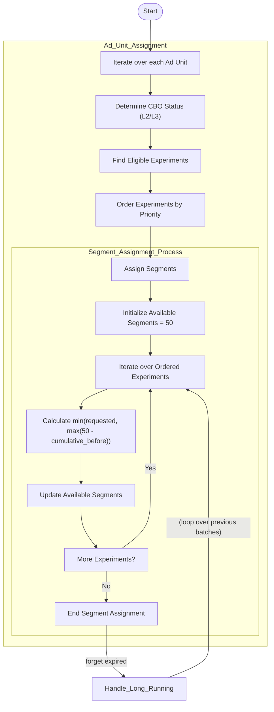
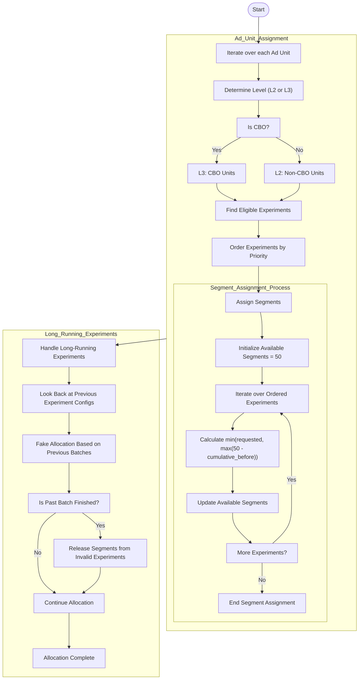

### Detailed View 





==⚠  Switch to EXCALIDRAW VIEW in the MORE OPTIONS menu of this document. ⚠== You can decompress Drawing data with the command palette: 'Decompress current Excalidraw file'. For more info check in plugin settings under 'Saving'


## Drawing
```compressed-json
N4IgLgngDgpiBcIYA8DGBDANgSwCYCd0B3EAGhADcZ8BnbAewDsEAmcm+gV31TkQAswYKDXgB6MQHNsYfpwBGAOlT0AtmIBeNCtlQbs6RmPry6uA4wC0KDDgLFLUTJ2lH8MTDHQ0YNMWHRJMRZFAFZFAEYyJE9VGEYwGgQAbQBdcnQoKABlALA+UEl8PGzsDT5GTkxMch0YIgAhdFQAayKuRlwAYXpMenwEEABiADMx8ZAAX0mgA
```
%%
