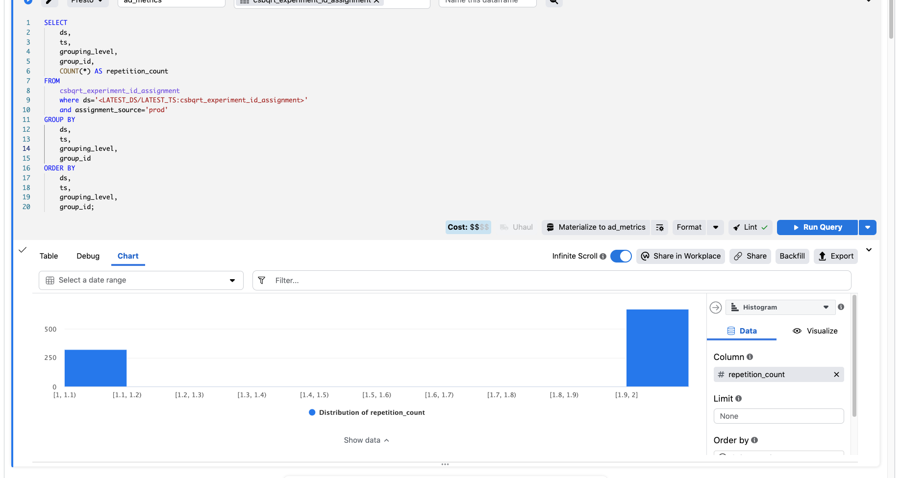

[[private.CSBQRT Assignment Latency Issues V2]]

1. So irst we do ploratory data analogies ot the table in order to figure out if a given petition, we have about 2 adpub cycles:
   [cell](https://fburl.com/anp/ob92nh4d)
   

between 1 and 2, which is good!

* * *

2. Histogram of typical lifetime of adunits, split per grouping level.

# Supply Loss Due to Latency of Assignment

# Mitigation plan

