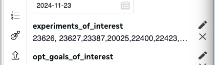
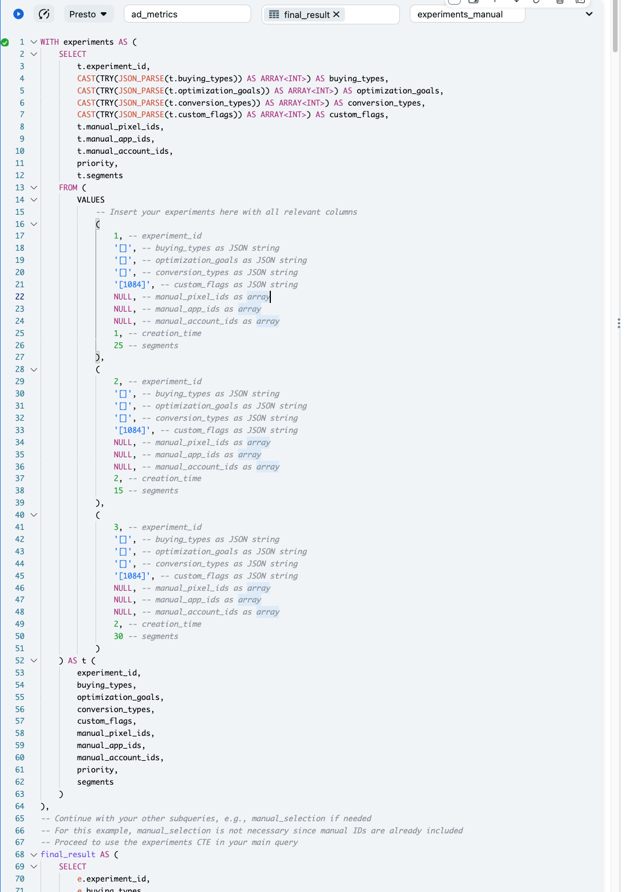
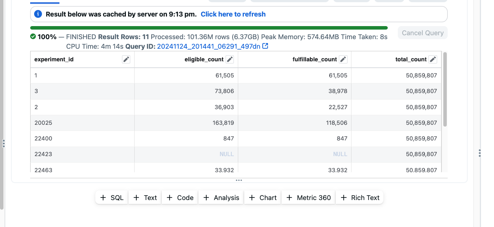
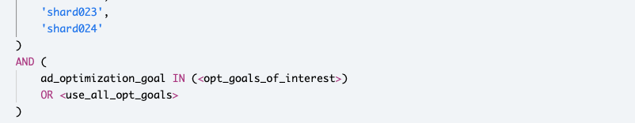

# Limited Purpose Estimator

What can you do-
assume you are the only game in town and want to see how can you pack things better for yourself.
you can use this estimator to see how much of the adunits of interest you can get for your experiments, how much for each experiment, and how much of the total adunits of interest you will get.

https://www.internalfb.com/intern/daiquery/workspace/7865152050225384/595049776206362/

you can insert experiments of interest in 2 ways here:

1. add it to the 'experiments of interest' macro

2. manually input experiment data in the 'experiments_manual' cell.

3. you can add opt goals of interest:

4. or use all opt goals.
5. In the final cell you get an estimation of what experiment gets how much of the adunits of interest you have.

6. you can similarly filter the adunits in here:
https://fburl.com/daiquery/mdvce89e
and add some other

to add other filters on the opt goal and so on.

 