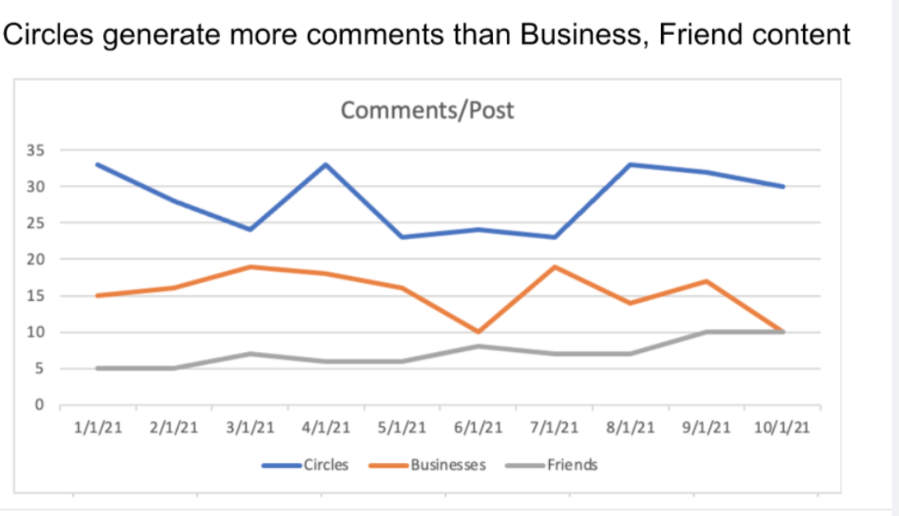

* agility 
* metrics and success criteria
* hypothesis

Description
Let’s say we both work at a social media company that has a product called Circles that exists as a separate feature of the broader product. Specifically, Circles are separate spaces where people can connect with other users (who may not necessarily be their friends). Circles are used for a variety of purposes — small Circles to keep in touch with families and friends, large Circles for people (usually mostly strangers) who have some sort of common interest or hobby, circles for buying, selling, and trading goods or services, and many others. Content in Circles works just like any other content, meaning you can like, comment, share it and you’ll also see distribution of content from Circles in the main Home Page as well as get the Updates and Notifications.

Question Statement
 Q1: What metrics should we use to define the overall success of the Circles product? 
[Setting Goals & Success Metrics]

Q2: Let's say the Engineering team is set to double in size and they look to DS to help determine where to put the new engineers. The team is structured into two Organizations, one pillar works on small friend and family circles and the other works on for larger community circles. How would you determine which area to invest in? 
[Analytical Design, Research Design]

Q3: Let’s say your manager sends you the following slide and asks “does this make sense to you?” How would you respond? And what follow up questions or recommendations would you add, if any? 
[Storytelling through data, Data Visualization]

Follow up and probing questions:

Q1: How should we think about Circles within the context of the overall product ecosystem?

Q1: The goal of Circles is to create meaningful communities and connections, how would you measure that?

Q1: Would you look at different success metrics for friends/family Circles vs. interest group Circles?

Notes to interviewer:

Spend time making sure the setup is clear. The nuance to communicate is that Circles is a separate feature/product that exists within a broader social network product.

There are a few different dimensions you’ll want to make sure to cover with the candidate. First, how should we think about/measure Circles within the broader context of the overall product (i.e., share of time spent, or engagement, overall lift via a holdout, etc). Second, there are two important and distinct product contexts: the users of Circles and the Circles themselves. Getting into these details about how the candidate would measure success across these different contexts is important.

Q2: How would we determine which use case is working better today: large interest or hobby Circles or small friend/family Circles?

Q2: How could we estimate where we will get a greater incremental return on investment?

Notes to interviewer:

This is a very broad question, so let the candidate have time to digest the problem and attempt to frame it on their own. There are a bunch of different ways this question can go, but at the core is the question of how do we compare the two different use cases.

The key thing to look for is how well the candidate is able to foresee possible data and/or react to tradeoff (i.e. what if one use case has more users, but the other has deeper engagement per user) as well as how they frame the problem (i.e. do they try to calculate total engagement and compare or do they consider the marginal calculation)

Q3: As presented, does the data make sense to compare side by side? What might be different about posts across these three content sources?

Q4: What additional information could we include to tell a more complete picture?

Notes to interviewer:

The data presented is meant to be misleading. The candidate should be able to identify that the populations might not be apples to apples in at least two important ways. 1. The number of impressions per post might differ across the different content types and 2. The users might be different across the content types (i.e. heavier users use Circles). From there the candidate should be able to identify ways to improve the presentation of the data.