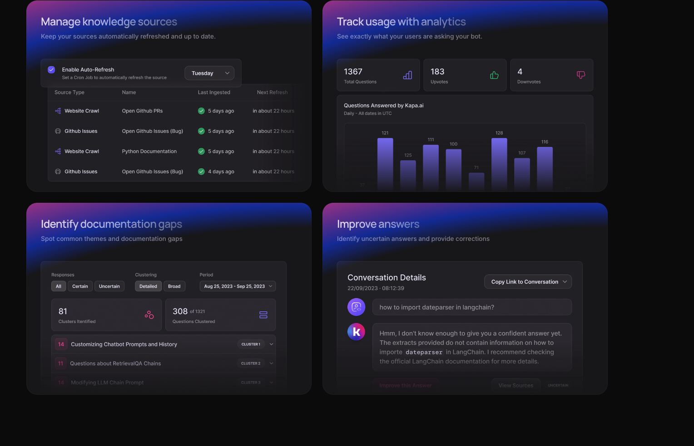

- instala ai answers for your technical users
- knowledge base
- links, graphs
- connecting knowledge sources.
- metamate for anything

* * *

Message

- work seems interesting, sounds roughly similar to an internal product.
- automated QnA based on internal knowledge base.
- different custom bots, doing a combination of prompting, search, and custom code.
- automatically up to date.
- grounded in truth (checkers for 'truthfulness', e.g. 'is this query valid')?

Feedback loop for users to correct answers.

about kappa

- interested in graphand knowledge bases in general (e.g. i supported a pkm system, so also personally interested in'comulication).
- product  seems worth doing, sounds roughly similar to an internal product.
- we have some automated QnA based on internal knowledge base, I casually look at the dev process over there..
- different custom bots, doing a combination of prompting, search, and custom code?

 what i like/dislike about meta
\++ tech, users, meaningful problems, mostly focused on metris
\++ compensation.

- a bit political, team-wise, the team lead and manager block my initiatives.
  \-= expectations unclear, they're blocking remote work, so hard to transfer
  \-- a lot of metric gaming, if you're more honest on the metrics, difficult

questions:

- opinionated vs flexible platform? have you found the right balance between giving more options to userrs?( product-market fit question) 
  what is the position
  comp
  position remote

