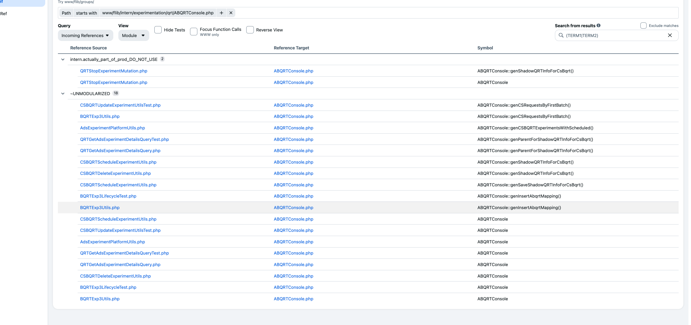

## remove bqrt_abqrt_experiment_map (T187716127)

3 work days

### T205903419 [BE] Deprecate non-www usages of bqrt_abqrt_experiment_map table

### T205903452 [BE][CSBQRT]bqrt_abqrt_experiment_map table- fix up ent edge, depending on that

## Update usage of shadow qrt experiment map (T205902730)

3 work days

### T197252286 Deprecate/Update genParentForShadowQRTInfoForCsBqrt in ABQRTConsole.php

### T197252147 Deprecate/Update genSaveShadowQRTInfoForCsBqrt in ABQRTConsole.php

# Removal of Raw SQL in BQRTExp3Utils (T179515160)

## It's used in qrt_exp_version_state

We are addressing the deprecation of raw SQL usage within the ABQRTConsole.php to reduce error-proneness and improve test coverage. The primary objective is to remove the `bqrt_abqrt_experiment_map` table and ensure its dependencies are appropriately managed. Basic steps include updating the shadow QRT experiment map references to use ents instead of raw SQL, relocating necessary utilities to `entMvUtator` and `entActions`. We will also eliminate raw SQL from `BQRTExp3Utils` by replacing it with ent-backed operations. Additionally, existing legacy scrape tables and pipelines may be deprecated to remove unnecessary dependencies. This initiative aims to enhance code reliability, reduce SEVs, and streamline the overall data management process.
(image-3.png)
<https://www.internalfb.com/code/www/[389423524dac]/flib/intern/site/x/qrt/ads_experiment_platform/bqrt/__tests__/BQRTExp3LifecycleTestCommon.php?lines=530>

<https://fburl.com/code/7i23htsy>

<https://www.internalfb.com/code/search?nl_enabled=false&q=repo%3Aall%20qrt_exp_version_state&tab=all&lang_filter=python%2Chack&skip_preload=true>
it seems there are many refences to this table in the codebase, but none of them seem relevant/part of a working pipeline.
Is there an ent that can manage the state?

# Problem Statement And Task Description

Deprecate/rewrite ABQRTConsole.php
This file is a root cause for many SEVs, the most recent one is S439033. Absence of  code is poorly covered with tests and is error-prone.
This project can be presented as: 
follow-up for some SEVs S439033
Goodbye raw SQL in bqrt www
Deprecation of legacy code
[Potentially] Deprecation of additional scrape tables and pipelines
Remove dependency 
[GSD Link](https://www.internalfb.com/gsd/1140518516447378/1187097499280937/list).

# Current Task List

## T197252286

Update genmparentForShadowQRTInfoFoxCsBqrt - raw sql wriites to crud ents.
move the requiretd utilities to entMvUtator and entActions

### Task notes:

This reads from `abqrt_shadow_qrt_experiment_map`, which is used how? unclear...
overall it's not clear how exactly the shadow experiments are created or managed...

## looking at the various parts of the shadow qrt part

can we just move the shadow qrt reference to the EntBQRTadvmexperimentEnt

Task: do that

## Task

Make ents out of the shadow qrt experiment map, and use that instead of the curren system? 
TODO: consult with someone how to add the shadow qrt to one of the ents?

Alternatively, we can just add ''the shadow as an ent property of the qrt if existing or something like that?

# Console- Usage Analysis

From codexref:



# Usages analysis

## bqrt_abqrt_experiment_version_map

[codehub search](https://www.internalfb.com/code/search?q=repo%3Aall%20bqrt_abqrt_experiment_map&skip_preload=true)

### Hunting Down what's needed here

![[Pasted image 20241025192915.png]]

There is a non-internal user in [Internal Login](https://www.internalfb.com/code/fbsource/[10d8fa1ca4a269eb1cb1b781a2a8ae77161a1c2b]/fbcode/dataswarm-pipelines/tasks/ad_metrics/qrt/qrt_experiment_metadata/scrapes/bqrt_metadata_scrapes.py?lines=52)
and in [Internal Login]\(<https://www.internalfb.com/code/fbsource/[10d8fa1ca4a269eb1cb1b781a2a8ae77161a1c2b]/fbcode/dataswarm-pipelines/tasks/ad_metrics/qrt/qrt_experiment_metadata/scrapes/bqrt_metadata_scrapes.py?lines=52z>; however, it is also in something that looks like ent backing- in ent metadata scrapes...

constzstring EXP_TABLE = 'abqrt_experiments';
  const string EXP_VER_MAP_TABLE = 'abqrt_experiment_version_map';
  const string BQRT_ABQRT_EXP_MAP_TABLE = 'bqrt_abqrt_experiment_map';
  const string BQRT_SCHEDULED_EXP_TABLE = 'bqrt_schedule_adv_exp_request';
  const string ABQRT_SHADOW_QRT_EXP_MAP_TABLE =l
    'abqrt_shadow_qrt_experiment_map';

# abqrt_experiments

- scrape table; 
  used for in many places- d

![[Pasted image 20240909175136.png]]

# Abqrt_experiment_version_map

<https://fburl.com/code/qrdgz2o3>
populated in dataswarm, inputs are q_experiments and q_versions (
from qrt...
).
so, why do we need this?

there is this code pointer here:

```
    await self::genInsertValues($cols, $values, self::BQRT_ABQRT_EXP_MAP_TABLE);
```

However, it seems this table is backed by the ent an'yway...

<https://fburl.com/code/hqpz3f5m>

![[Pasted image 20240909183739.png]] 

## What is happening to the shadow versions

they are in abqrt_shadow_qrt_experiment_map;
should we make an ent about them??

# bqrt_schedule_adv_exp_request

==⚠  Switch to EXCALIDRAW VIEW in the MORE OPTIONS menu of this document. ⚠== You can decompress Drawing data with the command palette: 'Decompress current Excalidraw file'. For more info check in plugin settings under 'Saving'

# Excalidraw Data

## Text Elements

%%

## Drawing

```compressed-json
N4KAkARALgngDgUwgLgAQQQDwMYEMA2AlgCYBOuA7hADTgQBuCpAzoQPYB2KqATLZMzYBXUtiRoIACyhQ4zZAHoFAc0JRJQgEYA6bGwC2CgF7N6hbEcK4OCtptbErHALRY8RMpWdx8Q1TdIEfARcZgRmBShcZQUebQAWbQBGGjoghH0EDihmbgBtcDBQMBKIEm4IIX1iAGYABh4AMwAVKDrmAH04ZoA5AAUYXGaASQANVJLIWEQKwOwojmVgidLM

biSkgA5tHh4ATi2AdjqNw6OAVn5SmG5nc/jD7Tqaw8Oa+L3N85rzpIA2K6QCgkdTceLfbR/P48JJ1PYvS6FSCSBCEZTSMHxbbveqHTZ/JI1HibJI8RGTCDWJbiVB1QEQZhQUhsADWCAAwmx8GxSBUAMRJBCCwUrSCaXDYFnKZlCDjETnc3kSJnWZhwXCBbKiiCNQj4fAAZVgywkgg82sZzLZAHUQZJuHwkQymayEEaYCb0GbyvSZeiOOFcmgkvS2

OrsGobsG6nSndLhHBhsQg6g8gBdemNciZJPcDhCfX0whyrAVXB1bUyuUB5gp4oU6Y0mpIgC+9LCCGI60Jm0O5x4NU2jopjBY7C4aEH9NHrE4PU4YnWryhdXOeKLzAAIukoJ3uEyhAh6ZphHKAKLBTLZFP5wtOoRwYi4Xdd4OHMmbPaHeIw85D+lEBwLJ5gW+AAWwkp7mgjQEGEhQtuAGZ0LgcBwEaz40vW0AopkFREOiUArAwhAIBQABCEpSlW8p

cjy/KNAxjFEdgIialAwy7voRpWhytFKugApCkJzGsVk7GcRRkrxrKNGKhUKocGqGpiSJpBsRxGQAGJ6oaxo0gyXI+oUEAsWpYkaVxLo2naDpXCZonZBZ3Guu6noGeadmmepnEAErCP6gbrJ5DniRkADy4aRusMbBWZjmcZpnBQJpuD6HqUaoOSkBeeZCVJQahBGDSPCxqUOXxRkzRYFAACC+ETugwSNIRsXeRk6GkLValsBQKK4K+qC3mBxnlaF+

hnnKNXdb1IQDZS02qW1+hTcyFDNPA+nUURzDYMy+rjJOhJPEk8Q1KS37xCddQAsZO17fgACa3BfHUTw8H8MZwocfznNCWUQEYbAGNw9aQPQBCHus8GtblGR+TJNYphAW12dKJAFUVDqlZAaPEEaCBwNw/24wAsmwxAIBNuCaMEA0wfgYSo6QJAKnRaCgxAZFcnNfLsnsfN89qPkIMoBYavyZ6bpLksQNDI0hc5bIRVA443qBdlZqlCDCyWzOLCDT

pZNTtP7qQh70tgRCE2gB5Hk6HBa6b5tOsIUCATStty6UdgAFYIPMzAGg7cBkxTVM01BqD04zxkSirjDNED+AGw2G0VGEwTzOO2osYyBjrTMaBDeBkF07BdsUvgoS1VnCdJyB+rweAbZ0LqwR1ghLZAA=
```

%%

