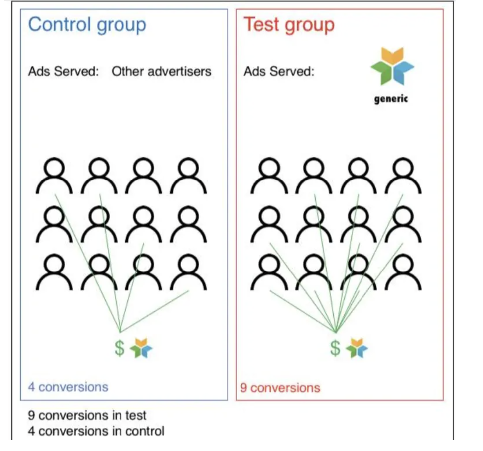
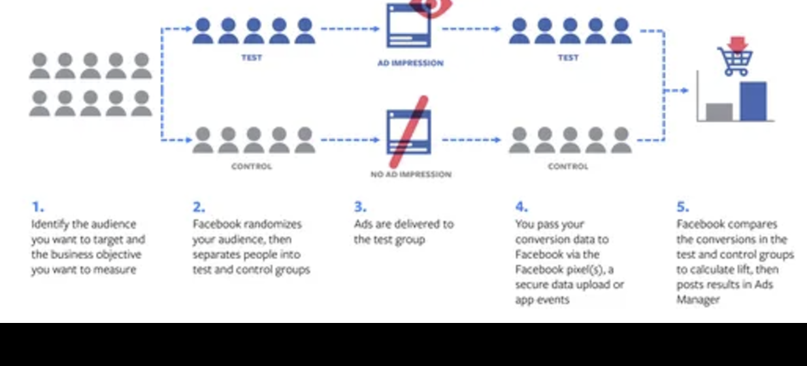
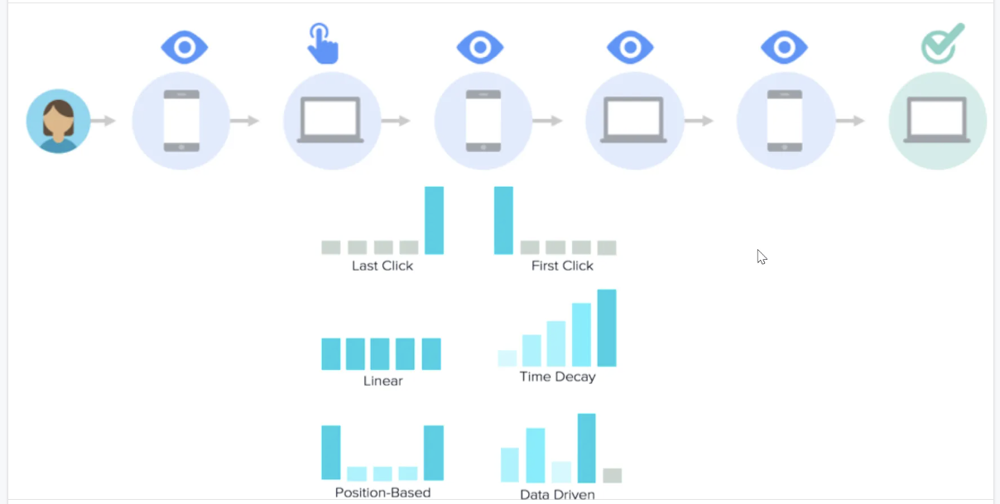
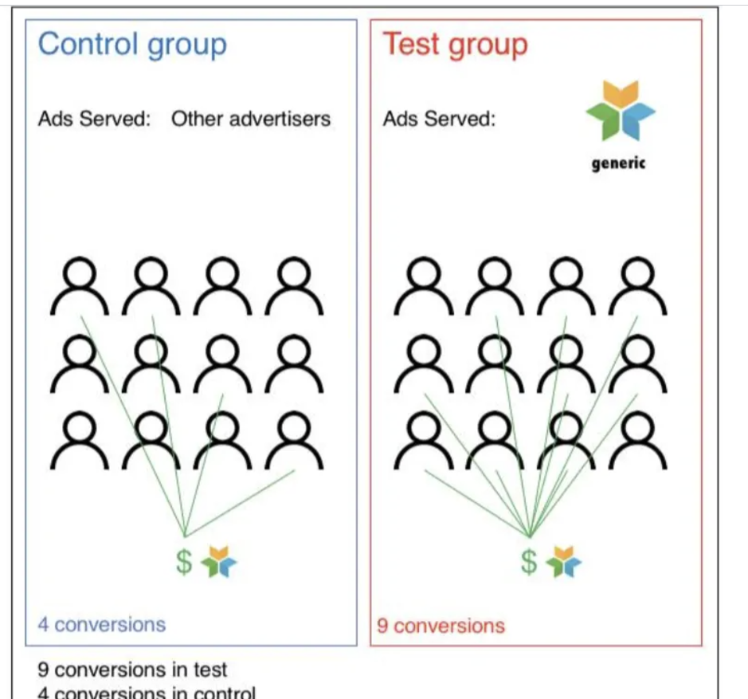
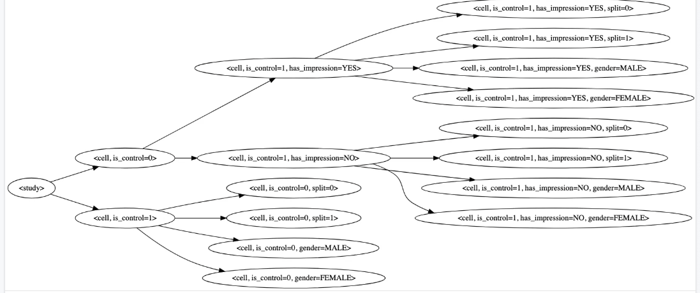
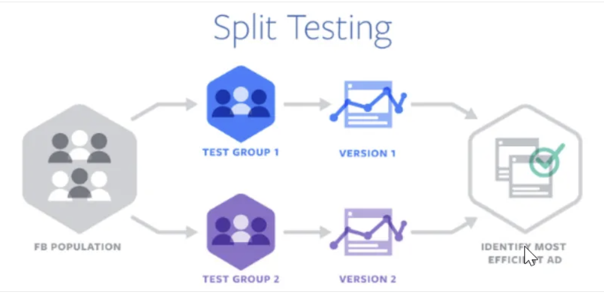
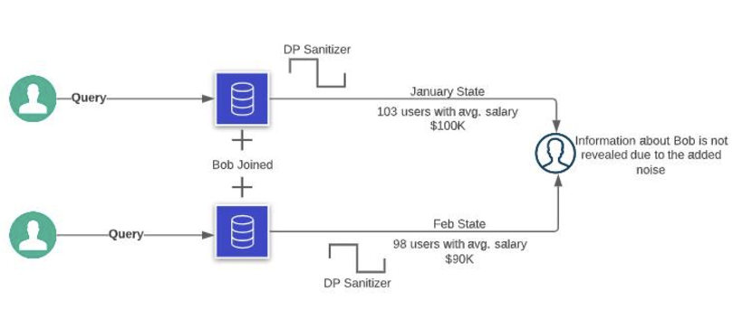
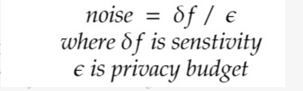
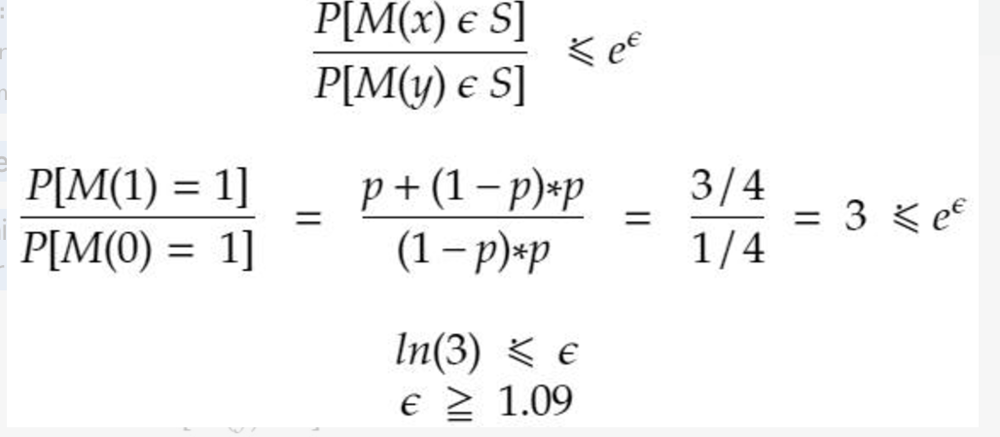
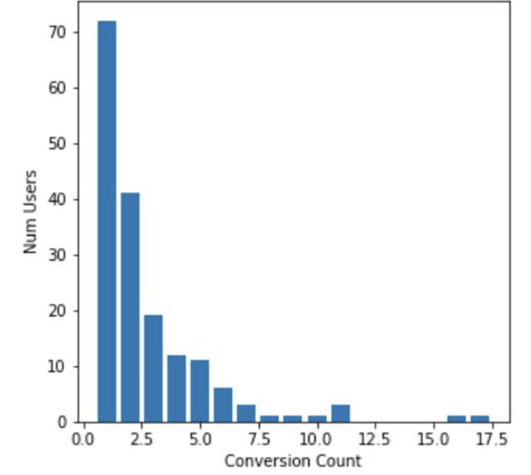

Day 1 - What is incrementality?

Incrementality is a measure of lift (not the Lift product) for a given marketing activity e.g. how many users made a purchase because of Facebook ads. 

Incrementality measures the causal impact of Facebook ads. 

Incrementality is calculated by running a field experiment where users are randomly divided into test (show the ads) and control/holdout (not shown the ads) groups.

lift = count(conversions in test group) - count(conversions in control group)  = 9-4 =5

Lift is the product to measure incrementality at Facebook. We will cover it in a separate post. 

Day 2 What is attribution?

Attribution is the process of understanding and assigning credit to marketing channels that lead to sales and other conversions.

These marketing channels are primarily digital marketing channels (e.g. paid search, display advertising, Facebook etc.) but can also include offline touchpoints (e.g. store visits, phone calls etc.)

Attribution modelling can help the businesses to understand -

Determine the best marketing channels/campaigns for investment, improving the ROI and balancing the digital marketing portfolio.

Correctly give conversion credit to a channel, campaign, and device

Determine which media mix should get the maximum budget next month.

How marketing channels affected each other’s performance and how they work together?

Day 2 What is attribution?

Attribution is the process of understanding and assigning credit to marketing channels that lead to sales and other conversions.

These marketing channels are primarily digital marketing channels (e.g., paid search, display advertising, Facebook etc.) but can also include offline touchpoints (e.g., store visits, phone calls etc.)

Attribution modelling can help the businesses to understand -

Determine the best marketing channels/campaigns for investment, improving the ROI and balancing the digital marketing portfolio.

Correctly give conversion credit to a channel, campaign, and device

Determine which media mix should get the maximum budget next month.

How marketing channels affected each other’s performance and how they work together?

...

Measurement recently launched Family of Apps (FoA) Attribution to measure the attribution both for organic (likes, shares etc.) and paid content (ads etc.) on FB. We will cover FoA Attribution in a separate post.

Day 3 What are the different rules-based attribution models?

Rules based models assign credit to ad click/impression based on pre-defined rules.

Last Click/Touch Attribution - assigns all the credit for conversion to the last clicked ad/impression. The model is used when least amount of buying consideration is involved e.g. As FMCG say Walmart you sell products like a toothpaste that require least amount of consideration by a buyer. 

First Click/Touch attribution mode - assigns all the credit for conversion to the first clicked ad/impression. The model is used for brand building/awareness e.g. you are a new player in a niche market.

Linear attribution model - assigns equal credit for conversion to all the ad clicks/impressions in a conversion path. The model is used when the interaction with the customer is critical. 

Time Decay attribution model - assigns more credit to the ad clicks/impressions that happened closer in time to the conversion. The model is used when you are running a promotional time sensitive campaign.

Position-Based attribution model - consider the full conversion path but gives weighted credit to the first and last touchpoints.

Day 4 - What is Data Driven Attribution? Does DDA measures attribution or incrementality?

The vision is to have an always-on, lightweight solution that assigns fractional credit for a conversion to Facebook touch points based on their estimated incremental impact.

Why DDA?

For any digital marketing strategy, the key is to understand what marketing channels (email, social, search etc.) have contributed to the user behavior (converting the user/buying behavior) and assign credit to them. The advertisers can rely on FB’s LIFT experimentation and directly measure the statistical causal impact and use the incrementality data to assign fractional credit to Facebook touchpoints. But LIFT studies have several friction points especially 

holdouts (participants who are not shown an add) have an opportunity cost associated to them

lift Experiments are sometimes noisy, and interpreting their results can be a nuanced task that requires statistical sophistication that small advertisers may not have

running Lift studies at scale to test the effectiveness of every single Ad Campaign isn't feasible,

pull-forward effect and temporal effects associated with the dynamic delivery system makes it necessary for tests to measure consumers' behavior over a prolonged period before the test is conclusive

higher granularity and smaller target populations translate to more measurement noise, so using Lift to measure incrementality at an L1 level (Ad) is often infeasible.

DDA measures incrementality

Day 5 What is Facebook Lift?

Lift is used to measure the causal effect of FB Ads i.e. it measures incrementality. The current version of Lift is AEP Lift i.e. Lift using Aggregate Event Processing (AEP), so Lift is using opt-in and opt-out aggregate data. 

We will cover AEP in the next post. 

Day 6 What is Aggregate Event Processing (AEP) for Lift (AEP-Lift) ?

Conversion Lift measures the true causal impact of ads (true business value) and is the flagship and differentiating product of the Facebook ads Measurement product suite.  Lift measurement uses a classic experimental design framework where users are randomly assigned to a test or control group (aka a holdout). Ads are served to the users in the test group while users in the control group are used as the baseline; we estimate incrementality by comparing the conversion from the test group to users from the control group that did not see that ad (note: incremental conversions are conversions that were caused by the ad; i.e. without an ad the conversion would not have happened). Before Signal Loss the Conversion Lift data processing would join conversion events with a specific user/touchpoint and store the user-level joined result. 

After Signal Loss (e.g., Apple’s ATT opt out), Lift has to make changes to be compliant with privacy policy: Lift now relies on Aggregate Event Processing (AEP) to match opted-out conversions to buckets of at least 100 eligible users for Lift calculations without storing intermediate, user-level results. The final Lift results are in turn calculated from these bucketed aggregates rather than from user-level joined results. AEP within Lift is responsible for matching and processing (AEP Service) opt-out conversion data to buckets with at least 100 unique users.

The key dimensions of a Lift bucket are 

Study information

study_id

User assignment

cell_id,

is_control

split_id (used in validation) [In -Progress]

has_impression (used to compute reach)

AEP vs AEM

For whatever reason we have a number of names that are confusing within Signals

AEP: Aggregate Event Processing - The matching of events from identifiers to aggregates, but not all of the processing

AEM: Aggregate Event Measurement - The processing of aggregate events, but not necessarily just for measurement(?!) as the name would imply

AEP-Campaign Bits: The matching for AEM, but not the rest of the processing as AEP would imply

AEP-Lift: Aggregate event processing for measurement only, but neither based on nor related to Aggregate Event Measurement (AEM). This term covers both the matching and the processing

AEP-QRT: Matching used on top of AEM. This term covers the matching, but not the rest of the processing as AEP would imply

This is relatively easy for eng immediately working on the projects to deal with but is a bit of a mess for XFN and partner teams

Is there a better way?

Is there any reason we don't just called all of this AEM or AEP (I don't think it matters which), with qualifications?

AEM-Lift

AEM-QRT

AEM-Campaign Bits

and then if you want to talk about the matching, you just add 'matching' to the end of it

AEM-Lift matching

AEM-QRT matching

AEM-Campaign Bits matching

and then we collective swear never to talk about AEP again, and qualify which AEM we're referring to when talking about AEM

Day 8 - What is the difference between Split Test and Lift Test?

Split Test does not use holdout groups. Let's say you want to compare the media (say image) within two ads. Say Ad1 shows the bike and Ad2 shows someone riding the bike. 

Ad1 will be shown to a set of users and Ad2 to another set. Split testing will help us to evaluate which Ad performed better.

Lift Test on the other hand uses holdout/control group and is a measure of incrementality i.e. incremental value generated by Ad1 vs Ad2 or vice-versa.

This post is the first in a 5-part series on Differential Privacy. The goal of this post is to explain the basics of differential privacy.

Why aggregation is not sufficient? 
It is the assumption that aggregate statistics are privacy safe, but they are not e.g. Let’s say an organization published the aggregated data - 100 employees with an average salary of $100K in Jan. This data is aggregated as you cannot recover the salary of an individual. Assume Bob joined in Feb., and now the organization published the aggregated data - 101 employees with an average salary of $102K. Accidently, the organization has revealed the salary of Bob (101_102K-100_100K = 302K). So, even with aggregated data, Bob’s confidential information is compromised. 

The same situation can happen when someone can query data from the database at two different intervals and can accidently reveal the information.

How can we solve the above? 
To ensure that no one can infer any individual's information, we can add noise in the output such that no single individual can significantly impact the aggregated or statistical information. 

In Differential Privacy (DP), Bob's data is not significantly impacting aggregated or statistical information. Taking the same example above, let's say the organization published 103 employees (noise of 3 is added) with an average salary of $100K and later after Bob joined, published another report with 98 (noise of 2 is added) employees with an average salary of $90K. With this data, it is not possible to find the exact salary of Bob.

How much noise is ideal?
This is the key problems in DP. Too small, we will reveal the information and too much, the aggregated metrics no longer provides any value. In general, random noise added is proportional to the largest possible difference the individual information could make in the aggregated data. e.g. for an employee data it is +1 or -1 and for salary it the highest salary of the employee. 
The largest possible difference is also called Sensitivity i.e. Maximum effect of an individual information on output analysis.  

Do we have plans to implement DP?
Yes, multiple projects are evaluating/implementing DP on aggregate data. The details will be shared in subsequent posts.

In the next post, we will discuss Local Differential Privacy along with few hands-on coding examples.
!\

 

 Part 2 - Differential Privacy
Part 1 - Differential Privacy introduced the basics and the concept of sensitivity, which is largest possible difference that one's individual information can make on the output e.g. in an employee database when we are looking at average salary, sensitivity is proportional to the max. salary of an employee. 

In this note, we will deep dive into the concept of Privacy Budget, why it is critical and a simple implementation of Differential Privacy.

So, how do we determine the amount of noise to be added?

Let's review our previous example where in an employee Bob joins the organization and our goal is to ensure that Bob's salary is not accidently disclosed e.g. average salary before and after Bob joined should not change. A simple approach is to exclude Bob's salary, but we can continue with the same argument (not using their data) for any individual joining or leaving the organization thereby resulting in a meaningless outcome. 

What DP says is that the outcome remains "approx. the same" but not "exactly the same". i.e. some deviation is permitted in DP.

Privacy Budget - How much deviation is permitted?

The permitted deviation from the desired output is the Privacy Budget. A small Privacy Budget will result in small, permitted deviation thus more stronger privacy protection but less accuracy for the utility/output e.g. if the privacy budget is set to 0, we will get the strongest protection but will have no utility as the output will be the same irrespective of any additions/deletions of the users.

 ε is used to represent privacy budget.  ε is set between .001 to 1.0 for statistical tasks (mean, median etc.) and between .1 and 10 for machine learning/deep learning tasks. 

Noise Formulation

Noise is positively correlated with sensitivity and negatively correlated with privacy budget

Simple DP Implementation

Say a channel is running a presidential pre-election analysis between two candidates (X and Y). The channel surveyed 10000 individuals on whether they will vote for X? The response from the people is binary - yes (1) and no (0). The goal is to count 1's and figure out the % of individuals that will vote for X. Let's add noise to the data before it is collected to protect privacy of the individuals. We also need to ensure that we are not altering the results.

Let's flip a coin. If the coin is "head", the submitted answer is same as the truthful answer.
If the coin is "tail", flip the coin again. If the answer is "head", answer 1 (yes) else answer 0 (no)
If p is the probability of head. The probability of the truthful answer is p+(1-p)_p i.e. 1/2+(1/2_1/2) = 3/4 and probability of wrong answer is (1-p)_p =1/2_1/2 = 1/4

The above randomization is the source of privacy.

import numpy as np
def random_response(response):
    ans = response == 1 
    if np.random.randint(0,2) == 0:
        return ans # Return the True Answer if coin flip is "head"
    else:
        return np.random.randint(0,2) == 0 # Return a randomized answer on second coin flip
Formal Definition

A mechanism M satisfies ε DP for every two neighboring datasets x,y and for every subset S ⊆ Range(M)

Part 3 - Differential Privacy
In the previous note, we discussed the mathematical formulation of DP. This note is focused on a practical example of DP. 

Let's say we have a conversion histogram that describes the number of users who converted once, twice or n times.  The goal is the apply DP on this conversion histogram. 

Let's use Laplace Distribution to add noise. The Laplace Probability Density Function (PDF) is defined as below where b is the scale. For DP, we can calculate the scale as b = 𝛿∕𝜖.

Thus, to add noise, we can draw from the distribution Lap(x| 𝛿∕𝜖). 

senstivity = 1
epsilon = .01
np.random.laplace(loc = 0, scale = senstivity/epsilon)
The output histogram once the noise is added at different values of 𝜖 is below. As discussed earlier, the key is to figure out the right balance between Utility and Privacy. 

The Laplace noise can be added as above, or we can use IBM Differential Privacy Library. Below is a simple example -

from diffprivlib.mechanisms import Laplace
dp = Laplace(epsilon = epsilon, sensitivity = sensitivity)
dp_mech.randomise() #Pass the hist value

Few questions to ponder on -

What is the sensitivity in the above example?
Is Laplace Distribution the right approach? Why not exponential or gaussian? 
What is the mechanism to figure out 𝜖? Are there better approaches than a brute force approach?
What happens when we apply DP sequentially vs in parallel on the same data set?
How does privacy compose with multiple queries (ex. you query every day with a given epsilon_0 for a week, what is the total epsilon)
Should MMT have a lifetime epsilon that can be used over time or should it renew every once in a while (how often?)

