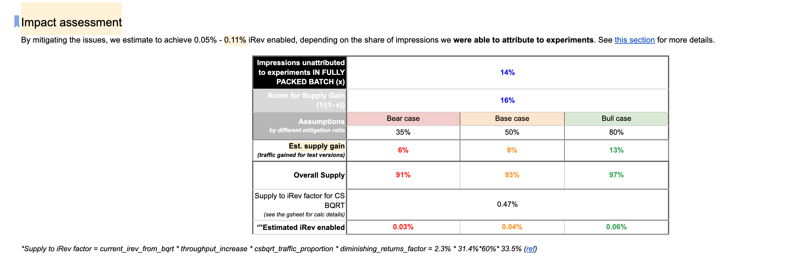

# Own Projects
2023- landned
#  clustered bqrt improvements
increased supply by 75%, corresponding to
P50: 8 Full Budget ABTests + 8 Clustered Budget ABTest → 8 Full Budget ABTests + 14 Clustered Budget ABTest). It translates to: **Additional iRev unblocked = (14-8) / 8 * 0.335% = 0.25%** irev.

This corresponds to **1.6-1.7 billion USD over 4 years of value** (irev unblocked) provided.

c
## Lead Experimentation Napkin Proposal

 *5HC requested, 4 year npv 1036-1248 million USD,
 
 * 4 year ROI 45-54x

 

# H1 2025 Projects 

## Ads Assignment Latency Reduction

Estimated impact at 0.03%- 0.06% irev enabled.
Approved and prioritized. Converts to 192-384 million USD over 4 years.

## Bin Packing Investigation

Converts to 0.1% irev enabled, converting to about 640 million USD over 4 years. 
clustered - 1600 at 0.25%, 
this is to estimate work for 
0.1%, so 640 million USD over 4 years.

## Participation to Multicell projects to pack things better

* Small experiments part- comparable to the impact above on current small experiment improvements.
roughly 64 million.

	* Meta’s Revenue from Advertisements: Meta earns approximately 85-90% of its revenue through advertisements on Facebook and Instagram, making the ads delivery system critical to the company’s financial success.
	* Ads Delivery System Optimization: Numerous teams work to enhance the ads delivery system to provide greater value to both advertisers and users, ensuring ads are effective and relevant.
	* Role of the Experimentation Team: My team focuses on experimentation for ads, acting as the final step to verify and validate improvements before they are fully released to the public.
	* Incremental Revenue Enabled: Our primary metric is “incremental revenue enabled,” which represents the additional revenue made possible through validated improvements in the ads system.
	* Direct Impact on Revenue: By increasing our system’s capacity to test and implement more improvements, we directly contribute to Meta’s top-line revenue, as there’s more demand for our services than we can currently meet.
	* Significance of Contributions: Enhancements that expand our throughput have a nearly one-to-one correlation with increased revenue, underscoring the substantial impact of my work on Meta’s financial performance.
    * Most projects funded in team **don't have a direct impact** (70%+) on incremental revenue, but the ones that do are the most impactful and easiest to staff, so proposing such projects is normally highly appreciated.

-----

# Irev Estimation Methodology for Budget ABTest
# iRev estimation methodology for Budget ABTest

A marginal diminishing correlation between % iRev and \# launches:

\[
\% \text{iRev} = f(\# \text{launches})
\]

Here, \( f \) is a saturating function with a top ceiling.   
In QRT, a fixed elasticity between ads score gain and \# exps is used:  

\[
\text{ads score} = 0.335 \times \text{exps}
\]

The elasticity coefficient 0.335 is from approved QRT team materials: [22H2 Experiment Value](https://docs.google.com/presentation/d/1BUFzV7U77hlGtKEJLYz1TmabG4bVkbVZq8HnOGj5his/edit#slide=id.g148041d3fa6_0_94). If we are using the same elasticity and further since in BQRT we assume a linear correlation between iRev and SAV, we would have:  

\[
\text{iRev} = 0.335 \times \# \text{exps}
\]

**Note that this approach is questionable as to why the elasticity is the same as in QRT. A better approach would be to collect more data points and fit the saturating curve ourselves.**  
Since we assume a linear correlation between (1) \# launches and \# experiments and \# launches and \# launchable slots, the above formula will be applicable to \# launches and \# launchable slots.  

\[
\text{iRev} = 0.335 \times \# \text{launches}
\]

\[
\text{iRev} = 0.335 \times \# \text{launchable slots}
\]

## Impact calculation

### Important notes

1. This impact estimations only covers iRev unblocked, while individual projects might have other impact and/or side-effects;  
2. Projects “Making Clustered Budget ABtest launchable” and “Adding 2 extra budget splits” impact estimations are not additive. Their joint impact is 0.41% iRev.   
3. Baseline readings:  
    1. Finance reported iRev from BQRT (targeting and pacing only):  
        1. H2' 21: 0.56%  
        2. H1'22: 0.61%  
        3. H2'22: 0.75%

### Universe Budget ABTest impact

\[
\Delta \text{iRev} = \text{elasticity} \times \frac{(\text{exps\_new} - \text{exps})}{\text{exps}} \times \text{iRev\_gain\_expected} = 0.335 \times 4 \times 0.75 = 1.005
\]

### Making Clustered Budget ABtest launchable impact

\[
\Delta \text{iRev} = \text{elasticity} \times \frac{(\text{launchable\_slots\_new} - \text{launchable\_slots})}{\text{launchable\_slots}} \times \text{iRev\_gain\_expected} = 0.335 \times \left( \frac{8}{6} \right) \times 0.75 = 0.335
\]

### Adding 2 extra budget splits impact

\[
\Delta \text{iRev} = \text{elasticity} \times \frac{(\text{launchable\_slots\_new} - \text{launchable\_slots})}{\text{launchable\_slots}} \times \text{iRev\_gain\_expected} = 0.335 \times \left( \frac{2}{6} \right) \times 0.75 = 0.08375
\]

# Irev to USD Conversion

NOTE: The following estimations are based on simplifications, ignoring interest rates, projections and targets, inflation, and other factors, but are 'good enough' for a a rough estimation of the magnitudes infolved, i.e. can be up to 20-30% off compared to sophisticated internal calculators.

revenue:

160-170 billion USD/year.

----

so, 1% iRev = 1.6-1.7 billion USD/year.
over 4 years, net present value of 1% iRev is 6.4-6.8 billion USD.

In total, if a project is to bring 0.1% irev, it would be worth 6400-6800 million USD over 4 years.

If re increase supply by 10%, the number becomes
0.335*0.1*10 = 0.335% iRev, or 2.1-2.3 billion USD over 4 years.

# Cost of 1 headcount engineer
About is about 300k eur/year, or 1.2-1.5 million USD over 4 years.
source:
https://www.levels.fyi/companies/facebook/salaries/software-engineer/locations/germany?country=91

