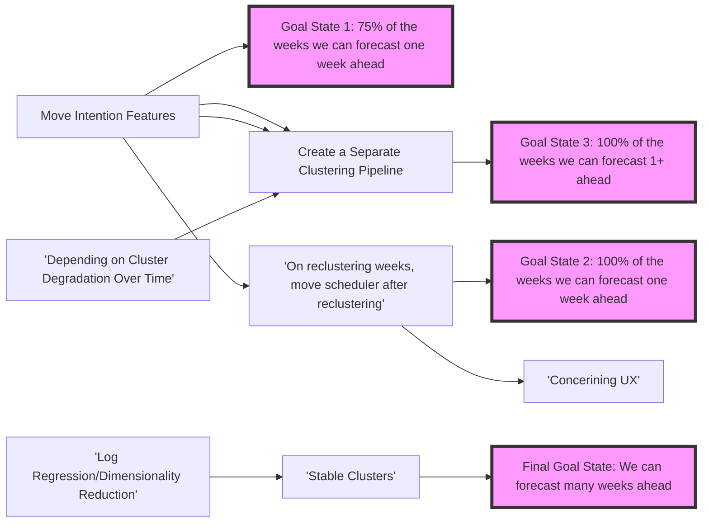

```mermaid
flowchart LR
    A["Move Intention Features"] --> G1["Goal State 1: 75% of the weeks we can forecast one week ahead"]
    A --> B["Create a Separate Clustering Pipeline"]
    A --> D['On reclustering weeks, move scheduler after reclustering'];
    D --> G2["Goal State 2: 100% of the weeks we can forecast one week ahead"]
    C['Stable Clusters'] --> G4["Final Goal State: We can forecast many weeks ahead"]
    B["Create a Separate Clustering Pipeline"] --> G3["Goal State 3: 100% of the weeks we can forecast 1+ ahead"]
    A-->B;
    D1['Depending on Cluster Degradation Over Time'] --> B;
    D2['Log Regression/Dimensionality Reduction'] --> C;
    E['Concerining UX'];
      D-->E;
    classDef goal fill:#f9f,stroke:#333,stroke-width:4px;
    
    class G1,G2,G3,G4 goal;
```
