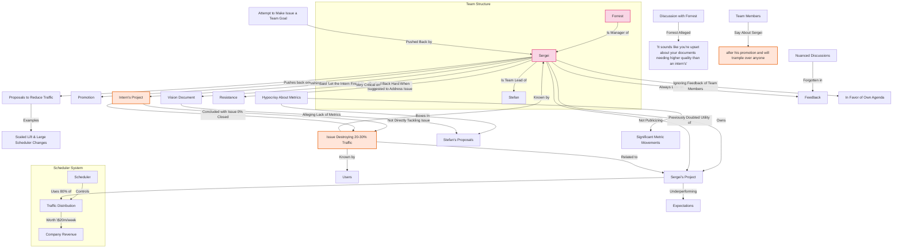

```mermaid
graph TD
    subgraph Team Structure
        A[Stefan]
        B[Sergei]
        C[Forrest]
        B -- "Is Team Lead of" --> A
        C -- "Is Manager of" --> B
    end

    subgraph Scheduler System
        D[Scheduler]
        D -- "Controls" --> E[Traffic Distribution]
        E -- "Worth \$20m/week" --> F[Company Revenue]
    end

    B -- "Owns" --> G[Sergei's Project]
    G -- "Uses 80% of" --> E
    G -- "Underperforming" --> H[Expectations]

    B -- "Pushing for" --> I[Promotion]
    B -- "Pushes back on" --> J[Proposals to Reduce Traffic]
    J -- "Examples" --> K[Scaled Lift & Large Scheduler Changes]

    B -- "Previously Doubted Utility of" --> G

    L[Issue Destroying 20-30% Traffic]
    L -- "Related to" --> G
    L -- "Known by" --> B
    L -- "Known by" --> M[Users]

    N[Attempt to Make Issue a Team Goal]
    N -- "Pushed Back by" --> B
    B -- "Said 'Let the Intern Finish It'" --> O[Intern's Project]
    O -- "Not Directly Tackling Issue" --> L
    O -- "Concluded with Issue 0% Closed" --> L

    B -- "Pushed Back Hard When Suggested to Address Issue" --> P[Resistance]

    Q[Hypocrisy About Metrics]
    Q -- "Boxes In" --> R[Stefan's Proposals]
    Q -- "Not Publicizing" --> S[Significant Metric Movements]

    T[Discussion with Forrest]
    T -- "Forrest Alleged" --> U["'It sounds like you're upset about your documents needing higher quality than an intern's'"]

    B -- "Very Critical on" --> V[Vision Document]
    V -- "Alleging Lack of Metrics" --> R

    W[Nuanced Discussions]
    W -- "Forgotten in" --> X[Feedback]

    B -- "Always Late on" --> X
    B -- "Ignoring Feedback of Team Members" --> Y[In Favor of Own Agenda]

    Z[Team Members]
    Z -- "Say About Sergei" --> AA[" after his promotion and will trample over anyone"]

    classDef critical fill:#f9d5e5, stroke:#e64980, stroke-width:2px
    classDef issue fill:#ffe5d9, stroke:#e85d04, stroke-width:2px
    class B,C critical
    class L,O,AA issue
```