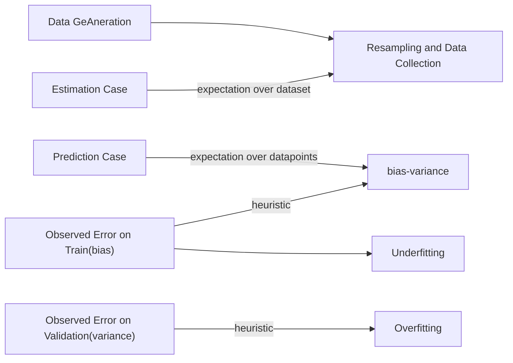

# Bias-Variance Tradeoff
$${\displaystyle \mathbb {E} _{D,\varepsilon }{\Big [}{\big (}y-{\hat {f}}(x;D){\big )}^{2}{\Big ]}={\Big (}\operatorname {Bias} _{D}{\big [}{\hat {f}}(x;D){\big ]}{\Big )}^{2}+\operatorname {Var} _{D}{\big [}{\hat {f}}(x;D){\big ]}+\sigma ^{2}}m,p$$

As we can see, the expectation is over all possible train datasets (?). 
So in reality, if we want to.


## Bias-Variance in Parameter estimation

The expectation is over possible datasets and thus (?) can be estimated via [[stats.Sampling.Bootstrapping]] of some kind.

## Bias-variance in Prediction  

The expectation here is over possible datapoints to predict. So we can look at the  
training error for an estimation of the bias and the validation error for an estimation of the variance.

The first step in improving generalization error is to characterize which component in the decomposition has the highest contribution, and go after that
component. Unfortunately there is no theoretically sound yet tractable way
of calculating the breakdown. However there are certain heuristics that are
extremely useful. Loosely speaking:


* Training error can be treated as the amount of Bias in the model or
estimator. If the model is unable to fit the training data itself well, then
it is likely that the model has High Bias. This is the underfitting [[stats.overfitting and underfitting]] regime.
* Gap between [[stats.Sampling.Cross-validation]] error and Training error can be treated as
the Variance of the model or the estimator. If the Training error is low
but the Cross Validation error is high, it is very likely that model has
High Variance. This is the overfitting regime.

## Sapmle Code

```python
import numpy as np
from sklearn.model_selection import train_test_split
from sklearn.linear_model import LinearRegression
from sklearn.utils import resample

# Synthetic data generation
np.random.seed(42)
X = np.linspace(0, 10, 100).reshape(-1, 1)  # Features
Y = 3 * X.flatten() + np.random.normal(0, 1, 100)  # Target with noise

# Parameters for bootstrap sampling
n_iterations = 1000
n_size = int(len(X) * 0.8)

# Containers for predictions and true values
predictions = []
avg_test_Y = None

# Bootstrap resampling and model training
for i in range(n_iterations):
    # Bootstrap sample
    X_train, Y_train = resample(X, Y, n_samples=n_size)

    # Train model
    model = LinearRegression()
    model.fit(X_train, Y_train)

    # Hold-out sample for testing
    X_test, X_holdout, Y_test, Y_holdout = train_test_split(X, Y, test_size=0.2, random_state=i)
    Y_pred = model.predict(X_holdout)

    predictions.append(Y_pred)

    # Store the first test set for comparison if not already stored
    if avg_test_Y is None:
        avg_test_Y = Y_holdout

# Convert predictions to a numpy array
predictions = np.array(predictions)

# Debug shapes
print(f"{predictions.shape=}, {avg_test_Y.shape=}, {Y_holdout.shape=}, {Y_pred.shape=}")

# Compute Bias^2
avg_predictions = np.mean(predictions, axis=0)  # Average predictions
bias_squared = np.mean((avg_predictions - avg_test_Y) ** 2)

# Compute Variance
variance = np.mean(np.var(predictions, axis=0))

# Display results
print(f"Bias^2: {bias_squared:.4f}")
print(f"Variance: {variance:.4f}")
```