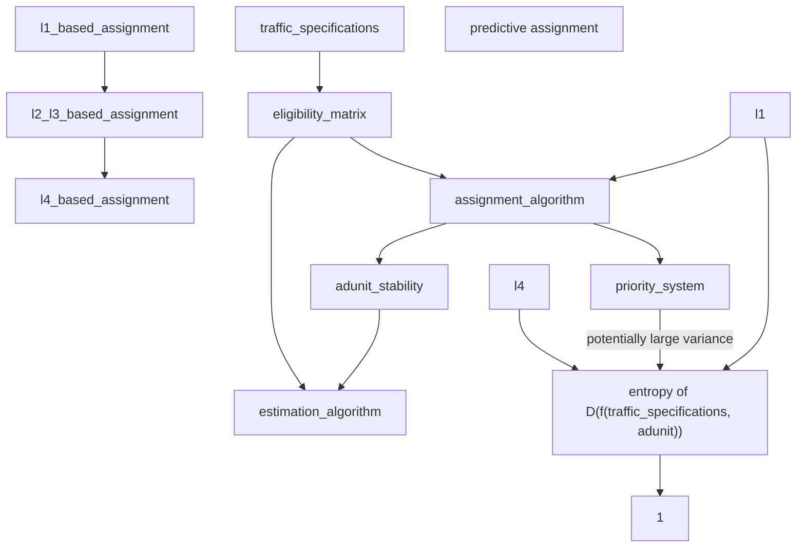

```mermaid
graph TD
    assign_algo["assignment_algorithm"] --> adunit_stab["adunit_stability"]
    adunit_stab --> estimation_algo["estimation_algorithm"]
    assign_algo --> priority_system["priority_system"]
    l1_based_assign["l1_based_assignment"] --> l2_l3_based_assign["l2_l3_based_assignment"]
    l2_l3_based_assign --> l4_based_assign["l4_based_assignment"]
    traffic_specs["traffic_specifications"] --> eligibility_matrix["eligibility_matrix"]
    eligibility_matrix --> estimation_algo
    eligibility_matrix --> assign_algo
    l1 --> assign_algo
    l4 --> entropy_D["entropy of D(f(traffic_specifications, adunit))"]
    entropy_D --> one["1"]
    l1 --> entropy_D
    priority_system --"potentially large variance"-->entropy_D
    predictive_assignment["predictive assignment"]
```