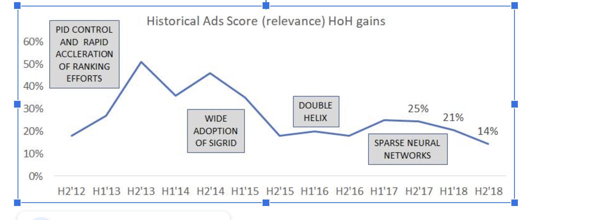
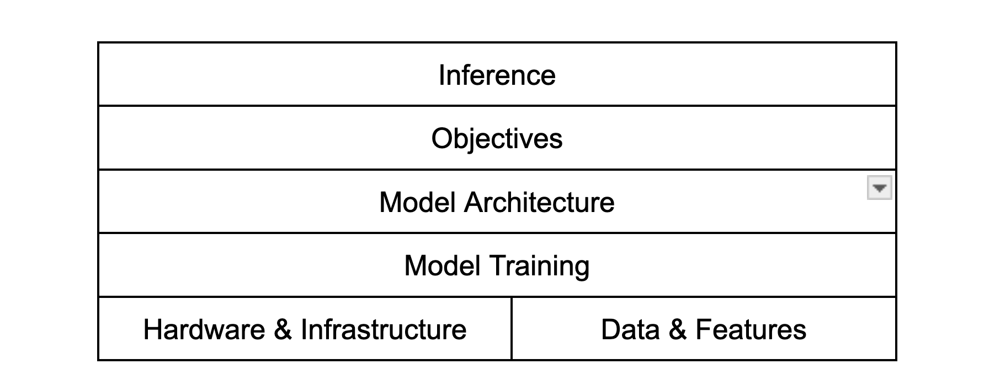
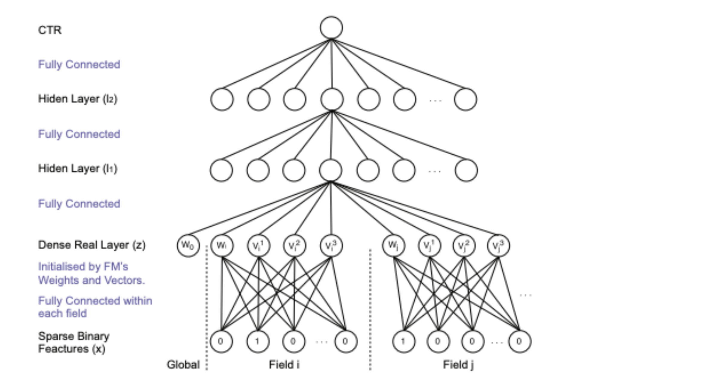
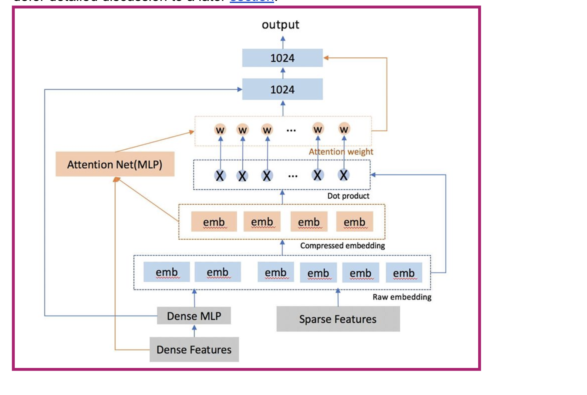
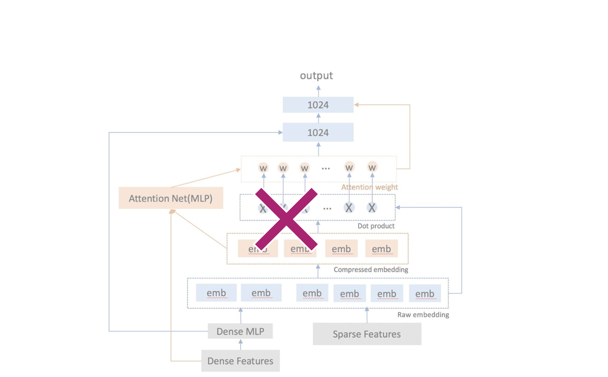

Last major updates: 2020
Abstract 
This technical white paper aims at setting the foundational 2 to 3 year strategy for modeling technologies for the Facebook ads machine learning stack. It is updated at least every 6 months to stay up to date to the current academic and industrial landscape. It sets the foundation of the roadmaps for ads modeling teams, and is updated according to the findings of the latest production applications. The goal of the white paper is three-fold:
It lays out the basis of the modeling teams’ 2 to 3 year roadmaps. In other words, if the world of modeling technology had ever been static, then we would consider the modeling problem largely “solved” if we have fully developed (or proved no value otherwise) and extracted gains from all of the areas of potential investment mentioned below. 
It helps us maintain a continuum of our roadmaps. The targets for actual goals will be considered as realization of achievement of the below mentioned directions along the way of marching towards the ideal states. Teams working on different areas may work in depth for many halves or years to fully develop and realize the impact of the technologies.
Because the paper has studied extensively academic as well as industrial state-of-the-art, it can also serve as a guideline and reference for overall development in the modeling technology area for other teams at Facebook. It is recommended for Facebook teams to collectively contribute to this document and co-develop with core AI infra teams and the AI org to build components and APIs that can be shared and re-used company-wide. It is also recommended that Facebook teams use this as a reference to gauge and develop their advancement in the modeling machine learning area. 

This whitepaper is also condensed into this spreadsheet which provides an executive summary and overview of our progress. 

Table of Content
Abstract	1
Table of Content	2
Motivation	5
Guiding Principles	5
Document Structure	6
Model Architecture	7
Memorization and Generalization	7
Generalization techniques	7
Memorization techniques	9
Ideal State and Strategy	10
Model Capacity	11
Mixture of Experts (MoE)	11
Sparse Modeling Capacity	13
Enhanced Feature Interactions	13
Ideal State and Strategy	15
Modeling the Generative Process of Data	15
Graph Learning	15
Sequence Models	17
Ideal State and Strategy	19
Objective Functions	19
Additional Loss Functions	19
Beyond Cross-Entropy	20
Whole Page Ranking and Long Term Value	21
Ideal State and Strategy	22
Optimization on A Mixture of Distributions	22
Multi-Task Learning	23
Ideal State and Strategy	24
Training Data	24
Training Data Quality and Quantity	25
Modeling Position Effect	25
Negative Data	26
Per Stage Training Data	26
Ideal State and Strategy	27
Leveraging More Information	27
Internal and External labels	27
Distillation	28
Cross Domain Data Transferring	28
Ideal State and Strategy	29
Model Training	29
Training Algorithms	29
Optimizers	29
Distributed Training Algorithms	30
Training Efficiency	31
Ideal State and Strategy	31
Training Process	32
Multi-pass Training	32
Model Training Robustness	32
AutoML and Neural Architecture Search (NAS)	33
Ideal State and Strategy	33
Model Inference	34
Model Compression	34
Quantization	34
Pruning	34
Clustering	35
Ideal State and Strategy	36
Caching & Reusing	36
Cache Results	36
Cache Intermediate State	36
Ideal State and Strategy	38
Infrastructure Enhancements	39
Hardware Design	39
Increase Computation Power	39
Memory/Network Considerations	41
Ideal State and Strategy	42
System Design	43
Disaggregated Predictor	43
Distributed Inference	44
Ideal State and Strategy	45
Topics to Cover Elsewhere	46
Appendix	47
Aggregated Ideal States and Scoring	47
Deprioritized Content	47
Principle (End Objectives)	47
Ads Value Optimization	47
References	48

Motivation
Ads ML models produce impactful insights and predictions that guide our most important business decisions. They are the lifeblood of the ads ranking system, thus continually improving and evolving them is critical for our success.

As shown in the following figure, there are two types of modeling improvements - continuous improvements through incremental changes, and step function changes that bend the curve. 
For example Sigrid (large scale linear models) enabled us to use massive scale sparse features and data, while DoubleHelix / Factorization Machines started the use of embeddings to figure out the relevance between Ads and users, and SparseNN took our modeling stack into the Deep Learning era. This whitepaper lays out the overall landscape of the modeling pillar, and focuses on building a pipeline of modeling breakthroughs.

Guiding Principles
The writing of this document is guided by the following principles. We hope these principles can provide clear directional guidance, yet are not too prescriptive. It’s also our endeavor that listing these principles can facilitate meaningful directional debates and inspire people.

More data helps. This is one of the most basic principles of ML. A big portion of recent ML advancements are powered by this, and it’s supported by years of practices in FB. We should learn from data/features with higher volume, comprehensiveness, quality, and granularity. We should also design models to leverage more internal/external signals, and optimize for different reward functions.
Larger model capacity helps, if used wisely. This is another basic principle of ML which goes hand in hand with [P1]. This is a double-edged sword though, since larger model capacity can induce additional risks of over-fitting and higher infra and operational costs, which need to be balanced against its incremental value.
Develop more generalization capabilities. A peculiar characteristic of this field is that new Ads are always emerging and the underlying data distribution changes constantly. Thus, it’s plausible that model accuracy gained through generalization (vs memorization) is less demanding on data volume, better on cold-start traffic, more robust, and easier to transfer across objectives and domains. From the hardware viewpoint, generalization maps better to increasing computational power which will be made significantly cheaper, while memory has been consistently expensive. 
Understand people, by learning from the data they create. To understand this principle, we need to go back to the mission of ads delivery which is to make every impression meaningful. We do this by learning from all the available user data, whilst respecting their privacy. 
Clearly frame ML computation into stages, and co-design with infra. Efficient designs can save us infra cost, achieve more business value, and even turn the difficulties into opportunities. Best designs usually originate by considering models, systems, and data-flow holistically. Neural-nets, owing to their modular nature, are particularly amenable to co-design.
Design ML models for clear, maneuverable systems. ML innovation itself is a long term process. If done wrong, it’s akin to high-interest debt. We should pay close attention to the development and operational costs by consciously designing systems that are easy to reason about, enabling us to find and fix regressions in our stack, and implement global optimizations. Additionally, we should design with an eye towards flexibility allowing us to swap and upgrade components in response to the changing technical landscape and business needs.

While we believe that these principles can guide us in the right direction, they shouldn’t be considered as rigid dogmas or applied in isolation.
Document Structure
The following diagram below shows the layers of the modeling stack:

Inference
Objectives
Model Architecture
Model Training
Hardware & Infrastructure
Data & Features

The lowest layers are composed of the data/features that are the inputs to the models, along with the hardware that is used for training and inference. During training, the model architecture and associated parameters are optimized for particular objectives, such as estimating the probability of a conversion. Finally, the trained models are deployed to the inference stages in the top layer, to serve the product needs. These layers work together as a complex system, and all of them influence our modeling choices. 

We will dive into each of these components in the rest of this document based on the principles alluded to earlier. In each section, we will provide:
Visibility into the state of the art both in academia and industry.  We have assimilated the data for the former through conversations with many people in different teams, and would like to acknowledge their valuable insights.
Thoughts on the principles involved, and trade-off considerations.
A perspective on the future directions of modeling, and strategies to get to the ideal states. As a part of each strategy, we also list some concrete project ideas that we think are the most promising.

Here is the centralized survey of what we know about this pillar in the industry.

For executive summaries, readers can mainly look at the Ideal State and Strategy sections for each direction. Here is an aggregated spreadsheet view. Here is a schematic view of the relationship among different projects.

For readers from the infra side, we summarized the infra implications from this document here.

We also plan to keep this whitepaper a living document that always reflects the latest state of the world and our thinking.
Model Architecture
In this section we will discuss model architectures from three viewpoints: generalization vs memorization, model capacity, and understanding people.
Memorization and Generalization
Typically, machine learning models have two ways to generate predictions - by memorizing patterns or generalizing common behaviors. Memorizing patterns work best at fine-grained prediction with ample data, and entail the memory intensive task of encoding pairwise affinities e.g. memorize that people who went to nba.com have higher probability of buying an espn subscription. On the other hand, generalizing models are good at problems where there are common patterns that can be encoded through semantic representations such as embeddings and their combinations.
Generalization techniques

External view. Early versions of generalizing components used Factorization Machines [1][2] to represent sparse entities as embeddings and model interactions between embeddings through pairwise inner products. The intuition is to learn embeddings for all concepts such that similar concepts would be embedded close to each other, resulting in large dot-products, while distinct concepts are pushed apart. An example of this architecture is shown below where we encode interactions between sparse features through pairwise interactions.

 
A second aspect of generalization power came from the combinatorial patterns among the concept embeddings. For example, it’s useful to model purchase patterns like “Electric Drills - Screws - Paint” after the users exhibited them. This is an actively researched area. For example Youtube uses RNN to model the sequential behavior of user watches [1002]. Most of the patterns are related to user behaviors and thus will defer detailed discussion to a later section.

Another fundamental aspect is to use more generalizable and semantically meaningful features. For example, several of our competitors have invested in building entity extraction technologies that have led to the development of a knowledge graph. This enables them to learn over stable semantic entities that are grounded in real-world concepts. We defer this discussion to the white-paper on data and features [link].

Internal state. We predominantly use components like embeddings to model concepts (ref. figure below for current architecture), and rely on pairwise inner products or successive variants such as DeepFM [39] to capture their interactions. See the figure below for a depiction of our current model. These practices are in line with what other players do, yet the techniques are relatively simplistic. This is because our current models are computationally constrained, and most of our recent effort has been devoted to saving computational cost. For example, ideas like dot compression [14] aims to reduce the cost of computing pairwise inner products. 

A depiction of our current ranking model

Combinatorial patterns among embeddings are often captured in the “pooling” layer in our models. Simple methods like Sum or Mean pooling are heavily used and form strong baselines. We have tried more sophisticated methods such as pairwise attention and self-attention based pooling. There are some early promising signals about pairwise attention back to 2017, but these were not launchable because of serving cost and infra readiness. Later, cheap pairwise attention was launched to production using pre-compute over the attention weights [link]. There have also been some recent attempts on exploring self- attention, but the results are mostly neutral.

Our current models are susceptible to overfitting as shown in the failure cases of multi-pass training. We believe this is because the models are memorizing labels (not to be confused with memorizing patterns discussed earlier), largely due to our reliance on raw id features - it has been shown that this type of overfitting is either significantly less severe or even non-existent for more content-based features.
Memorization techniques
External view. Memorizing components model pairwise interactions by directly learning affinities for a carefully chosen set of n-grams. The representative example of this is the deep and wide architecture (ref. diagram below) [7] used extensively at Google. In this architecture we separate the generalizing and memorizing components into the “deep” and “wide” components where the wide part comprises high-cardinality n-grams (e.g. user brand x ad brand) for which we directly learn affinities (e.g. users interested in Nike also buy Adidas) while the deep part is similar to the above. Having a large wide component allows the network to memorize affinities for tail interactions which would not be possible using embeddings. It must be noted that an underlying assumption behind learning a wide unary layer is the availability of sparse stable representations like brands names and entities through which we can memorize affinities meaningfully.

Certain types of signals are better captured by memorization, or other types of “shallow” architectures, especially those with specific physical meanings such as the positional bias, etc. An example can be found in [1001] on Youtube Chaining. The underlying intuition behind these approaches is to encode clear physical meanings into our models, instead of simplistically throwing everything into a “deep” arch, which can cause the model to capture spurious correlations. 

Internal state. We used to rely on memorization techniques in the past, in the form of counting features and sparse N-Grams in Sigrid. We then switched over to embedding based methods since FM. Recently, we also have some success in memorizing N-Grams in SparseNN such as bigram between BDT and sparse features [link], N-Grams of sparse features [link]. The success of id matching also demonstrates that there is value in modeling fine-grained interactions beyond what is captured through embeddings. Ongoing work on building stable id representations [6], and content understanding [8] should unlock this direction allowing us to build memorizing components in our models. Interestingly, there are also some ongoing efforts to quantify the operating points of each of these approaches (refer [68]). This could also potentially impact the design of our hardware since wide models spend a larger fraction of time in memory intensive gather operations.
Ideal State and Strategy
The ideal state would be models that clearly separate 1) more stable, semantic features (and we should make sure we have abundant such features) that are generalizable, 2) more volatile id features that need to be memorized, 3) features that are clear control signals (e.g. position bias, surface bias), and contain different sub-architectures to learn these different types of information. 
A
We suggest that generalizable features should be either captured by well-crafted n-grams for easy and clear memorization, or deep sub-architectures to learn their patterns and interactions without needing hand-crafted features such as NGrams. Volatile/ephemeral id features should either be replaced by its counterpart semantic representations (e.g. ad_id vs advertiser_id + product_category + creative_content), or captured by a shallow sub-architecture that can rapidly adjust to the newest data, and avoid their deep interactions with other parts of the model to make their volatility contained. Control signals with clear physical meanings can be fed to specifically designed shallow architectures. Lastly, this model would be able to continuously improve its component over the lifetime of the model without overfitting. 

In order to get to the ideal state, we should continue to create more semantic and generalizable features and use them to replace raw ID features as appropriate. We should be deliberate about the roles of different layers in the model, educate the ML engineers, and develop a terminology to describe them, so that we can easily apply the guidance in the previous paragraph. We should also develop mature components to enable such practices, such as easy to use semantic input layers, precise memorization layers without collisions, detection mechanism of embedding that didn’t receive enough training data, etc.

Our thoughts in this direction are mainly driven by Principle [P3], by using both more generalizable features and model architectures. It also interacts with [P1]; though more data helps, accumulating learnings on volatile ids that will disappear soon would be highly wasteful, and the suggested approach here should result in more effective use of data. It also helps reduce the ineffective model capacity following [P2]. Naive use of “generalization” everywhere might lead to unnecessary loss of precision and clarityclarify though, thus we still recommend a hybrid approach to leverage the strengths from both generalization and memorization purposefully. 
Model Capacity
Model capacity refers to the amount of information a model can hold, and the complexity of reasoning it can perform. AcademiaThe academia defines measures like VC-dimensions for it, but in practice people often use things like number of parameters, or the number of neurons/layers to roughly measure it for neural nets models. In these models, capacity also greatly depends on the connections among layers. It’s a critical factor of building powerful models, as captured in our Principle [P2].

In Facebook, model capacity generally falls into three buckets: dense (e.g. FC layers), sparse (e.g. embedding tables), and interactions (e.g. ResNet, Pooling, Dot and high-order interactions among embeddings).
Mixture of Experts (MoE)
Mixture of experts is an efficient way of increasing dense model capacity. The idea is to train a large network with potentially hundreds of billions of parameters by introducing thousands of experts (each itself could be a model) controlled by a gating network. Depending on the setup, it could be implemented as sparse gating where only a small subset of the experts are activated for every specific request or dense gating when all experts are activated with different weights. The computation could be easily parallelized during training and inference which makes it very friendly to the model training and inference platform. In some sense, the whole network can be viewed as a collection of experts specializing in narrow topics and we summon a small subset of experts depending on the task at hand.

This is a great embodiment of Principle [P2]. Its “smart activation” mechanism is able to achieve great model capacity without incurring much more computation cost, and can be well distributed. The memory cost is still high though. It is also a great endorsement of Principle [P5], where clever co-design of architecture and system could jointly optimize model quality and efficiency. We also need to pay attention to Principle [P1] as training each expert well will need a lot of data.

External view. Gating networks neatly capture the above intuition into an inference paradigm that can deploy very large models that seamlessly combine memorization and generalization. For example in [65], the authors demonstrate how this idea can be used to deploy state of the art machine translation models. In this case, the sparse gating function selects two experts to perform computations. Their outputs are modulated by the outputs of the gating network. There is also another work from Youtube where a gatingwhere gating network is utilized to improve the engagement of video watch [link]. A multiple gating network is applied in this work which could improve training efficiency by efficient parameter sharing mechanisms. The online testing result in Youtube online traffic is also very encouraging.

Internal state. The GBDT “sub-models” that we have been using is one form of MoE, though it’s manually crafted. There are some successful stories in Ads Ranking in leveraging learned MoE models in learning gating on features to improve per example level representations. In [link], dense gating network is introduced on dense features (where each dense neuron is treated as an expert) which shows some promising model quality improvement. Besides, there are also some on-going efforts exploring sparse gating networks on sparse features to jointly optimize for model quality and efficiency when there are large amounts of features in the model. This is going to play an even more important role as we keep adding more sparse features. There were past efforts back to 2017 [link] to sparse gating mechanism in the learning of over arch,  but these had to be rolled back due to memory and latency concerns. However, we are in a better position to reevaluate this idea owing to tail winds from two ongoing infrastructure projects - fully remote prediction and using ASICS - which will enable us to serve large distributed models.
Sparse Modeling Capacity
Embedding lookup tables are the primary modeling parts to learn from sparse signals and convert them into dense information embeddings. 

External view. Embeddings are used ubiquitously in the so called “neural recommender systems”, which is the dominant method in the industry. Embedding table capacity is often talked about in terms of their raw sizes. Multiple industry players report models sizes larger than one terabyte,s which should be primarily due to the embedding tables. Note that these numbers were mostly reported on content recommendation systems vs Ads systems.

Internal state. We have heavily used sparse features since Sigrid was developed in 2014. It has been an important lever to enhance our models, by adjusting the number of sparse features, ID/hashing ranges, and embedding dimensions (also multiple embeddings through num_sparse). For example, the number of features has increased 10x [link], the total embedding dimension (number of sparse embeddings x embedding dimension) for some sparse features has increased by 3x by leveraging per feature number of sparse embeddings [link] in the past 2 years since the beginning of 2017. In general increasing sparse capacity helps, while we cannot increase unlimitedly because of infra cost such as memory and network constraints during model inference. Therefore, we need to trade off with infra and operational cost. Sometimes, we also tradeoff between different model architecture dimensions to generate a stronger model with limited infra cost. For example, in order to control the model size, people are aggressively tuning down the hash size while increasing embedding dimensions to improve model quality [link]. However, there is also a tradeoff here. It is empirically observed that model quality would stop improving or even deteriorate if we keep tuning down the hash size even if tuning up the embedding dimension proportionally. A recent study suggests that we might be too low in terms of hash size that we should treat hash collisions systematically.

The Ads problem is special compared to general recommendation problems in that Ads themselves are highly volatile as the campaigns change, which is why we advocate for principle [P3]. Consistent with [P3], we encourage using more semantic and generalizable features, and for raw/volatile sparse IDs use more purposefully designed capacities (e.g. shallow and memorization focused). Moreover, semantic embedding should be heavily shared (in the extreme case, pre-trained) to ensure their consistent meaning. These measures will naturally result in lower capacity requirement on sparse capacity. Also, [P2] applies here in a reverse way: huge embedding tables without sufficient training data can lead to wasted resources or overfitting (see e.g. [1004]). We also have the infra incentive to limit sparse capacity given that memory has been consistently expensive, and most high-compute devices will be handicapped if the model has to go out of the device memory and do heavy communication. Sparse capacity should be geared towards more types of sparse features, and more precise modeling of key sparse feature that either need precise memorization (e.g. using large hash size or no hash) or rich semantic modeling (e.g. using large embedding dimensions).
Enhanced Feature Interactions
Feature interactions are important modeling components, since the essential task of Ads Ranking is to predictfigure the interactions between the users and the Ad.

External view. There is active research to go beyond the usual interaction layers such as concat and dot-product. One stream of work entailed modeling higher order interactions replacing inner products by outer products [4][5] by introducing a cross-network (shown below). Unlike inner products, each layer of this arch consumes a set of embeddings and computes pair-wise outer products. Thus, the inputs and outputs are sets of embeddings, over which this process can be iterated. As a result, these networks explicitly learn higher order interactions across multiple layers. Benchmark studies on publicly available datasets [40] suggest that this model out-performs prior inner product based methods. Arguably, the additional performance comes at the cost of increased computation. The authors of [5] propose to resolve this by using cross-networks on only a subset of features.
  
Internal view. There are some early successes from the addition of explicit N-Gram features such as bigram between BDT and sparse features [link], N-Grams of sparse features [link], [link]. Among these N-Grams, about 20-30% of them are >3rd order interactions for which the current pairwise inner product based SparseNN cannot explicitly capture. Although the addition of explicit N-Gram features looks effective, it is really difficult to scale up to add many of them because of infra cost such as computation, memory, network, etc. Therefore, modeling based methods are necessary to efficiently capture the high order interactions. We have experimented with higher-order interaction architectures such as Deep CrossNet from Google, which only produced very marginal gains. We also attempted to use the very popular self-attention at either the id or feature-level to capture higher-order interactions, but this has been so far unsuccessful. Ads Ranking also developed another version Higher-Order Net (HoNet), which provided more gains but at great computational cost. But with the advent of Accelerator, it could be a great chance to rethink this direction.
Explicit modeling high order interactions generally has a high cost, either by manually crafting NGrams (N>2) or designing neural connections between multiple layers. This cost grows at a geometric rate if unguided, and is unlikely to be fully solved even if using accelerators. CrossNet attempted to solve this problem but the approach is questionable. Therefore, we want to advise against heavy focus on creating generic catch-all high-order interactions mechanisms, unless there is a clear heuristic to do so or research breakthroughs to make it more efficient.
Ideal State and Strategy
We almost always want larger model capacities and it has a strong positive correlation with model accuracy. In this case, the ideal state consideration is around designs that offer the best gains with the lowest cost. For dense capacity, we should have Mixture of Experts (MoE) architecture that can be easily trained and deployed, to realize high overall capacity and low local compute cost. For sparse capacity, we hope that push for generalization power can significantly reduce the requirement, and we can use the capacity to focus on precise memorization and deep semantic modeling.

Principles [P2], [P3], and [P5] are primary considerations here. [P1] is also important to make sure we have enough good data to train high capacity models. We also make a related discussion in the Hardware section.

In order to get the ideal state, we should actively develop MoE architectures that are powerful and easier to use, for both training and inference. We should continue to create more semantic and generalizable features and use them to replace raw ID features as appropriate. For certain sparse features (e.g. memorization points, control signals), we should develop capabilities to avoid hash collisions. The development of generic high order interaction techniques should slow down unless there are clear intuitions or data points for composing features, or breakthroughs in this field.
Modeling the Generative Process of Data
This area of innovation in modeling technology is to model the generative process of the data. Since most of our data is generated by people, this essentially means understanding how people use our platforms. There are essentially two types of generative processes: connections and behaviors. We can capture the connections by graph learning and the behaviors through sequential modeling.
Graph Learning
A big portion of our data and predictive tasks are about figuring out the relationships between people and entities. Many relationships are best expressed through graphs e.g. user-friend, hash-tag follower, user-page follower graph. Additionally, formulating a problem in the language of graphs opens the door to specialized graph algorithms.

External view. Most of our competitors have long invested in developing large scale graph mining technologies [9] that support sophisticated combinatorial graph algorithms. An emerging trend [11, 12, 13] is to combine the representative power of graphs with the generalizing capabilities of neural networks.

For example, Pinterests’s PinSage system [15] combines node level information with embedding propagation using random walks to learn rich embeddings which can be used for downstream ranking applications. The technology combines node features, such as images, text annotations, with user-curateduser curated <pin, board> relationships (i.e. edges) through a Graph Neural Network (GNN). The GNN leverages the expressiveness of neural networks to model graph similarities by iteratively aggregating over neighbor embeddings, as illustrated in the following figure. The figure on the right-hand-side demonstrates how PinSage successfully combines node and edge signals to retrieve pins that are both visually similar and conceptually relevant.
  
Alibaba has also invested heavily on graph learning and through a dedicated graph learning platform called Aligraph [42] that is optimized to support multiple graph neural network algorithms sharing the “sample, aggregate and combine” pattern. Similar ideas have also been tested at Taobao [43] particularly in the context of heterogeneous graphs such as the user-click graph.

Graph learning has also been a popular research area in academia. Recently top conferences like KDD2019 and Neurips2019 each generated more than 30 publications on this subject. While not all these papers will be directly helpful to us, it’s important we keep track of the development, thereby leveraging the intellectual power in the related research fields.

Internal state. Digraph library supports a few traditional graph- based algorithms in offline mode, such as (personalized) page rank, graph clustering, but it lacks most recent advances in deep learning- based graph algorithms. In our current production models, we leverage partial graph information by building a TTSN to learn direct affinities over the user-click-ad bi-partite graph. This approach ignores multi-hop graph neighbors that are not directly connected. For example, a user's interest in NFL may be hitherto unknown and is only revealed by his friends' page likes. Another fruitful attempt in mining from graphs is the co-occurrence features. These sparse features try to directly encode similarity between a pair of objects by counting how many times the two objects co-occur. Through this counting, which corresponds to two-hop paths in user-object graphs, we can obtain a list of similar ids for a given id, e.g. the list of similar ad campaign ids, page ids, app ids. The consistent gains from these features suggest SparseNN cannot fully exploit graph information and learning from graphs should lead to incremental value.

Within FB, there are also some libraries/frameworks for modeling partial graph information, such as Filament2, MTV. However, they are still “shallow” models that are purely id-based and lack the ability to model multi-hop relationships as well as using node features. At the same time, Facebook AI is actively working on a platform called GRASP which can potentially serve as a scalable system for large-scale graph learning. There is also ongoing work in ads ranking towards using graph based models [10] with promising early results.
Sequence Models
Modeling sequences is a rich untapped direction given the prevalence of such data. 

External view. The first wave of sequence models used recurrent networks [16][17]  to represent state transitions. For example, these models could learn that once a user purchases an item, his likelihood of clicking on similar items drops significantly. Anecdotally, Google’s predictive targeting [63][64] system for display ads was built using this technology to model users’ offsite temporal behavior.

The main drawback of these approaches is the difficulty in adding more capacity to the models beyond stacking more layers. Thus, the second wave of sequence models used the same machinery (RNN/LSTMs) as meta-learners which could manipulate embeddings tables to build user representations. Intuitively, these techniques were aimed at learning algorithms to manipulate data (in the form of user embeddings) rather than explicitly model preferences. These ideas have been adopted by some of our competitors like Alibaba [18] and Google. More recently, Alibaba has successfully used memory network related tech [li,nk][81][82] to model a user’s lifetime history, as well as allowing modeling of sequences of over 10,000 events. This architecture is demonstrated in the figure below. Anecdotally people also try to use BERT -like techniques to model sequential behavior. [link] is another work that uses capsule network to extract complex user interests from behavioral data.

Sequence learning has also been a popular research area in academia. Recently top conferences like KDD2019 and Neurips2019 each generated more than 15 publications on this subject. While not all these papers will be directly helpful to us, it’s important we keep track of the development, thereby leveraging the intellectual power in the related research fields.

Internal state. There have been a couple of attempts at using sequence models in ads. The first attempt was to model the sequence of user-pixel interactions using an LSTM [20]. The idea was to train a sequence model that learns to predict users’ future organic behavior (using OBA data) based on his history of past website visitations; see the figure below for an architecture view. This showed some directional gains but is not under active development. Over the last two years, we have developed a better understanding of users’ offsite behavior and built additional content technology which can help resurrect this area.

The Ads Brain Stable Representation effort is an ongoing effort, which seeks to use the Transductive User Modeling (TUM) [19] framework to model a rich user history sequence. The idea behind TUM is to represent each event in the user’s history (such as ad clicks or page likes) by incorporating a variety of rich information such as the ad or page title, body, image, etc, and then subsequently summarize this sequence to a user embedding. This framework provides the flexibility to try out different sequence modeling approaches, and has been used for a wide variety of offline experiments. Ads ranking has launched an embedding feature produced by a TUM model to Mobile Feed CTR Model [link], but the framework would need to be production hardened before widely adopted.

Since training and serving sequence models can be resource intensive (for both network and CPU), the current approach is to train the TUM model once and then use the static model to update each user embedding whenever there is a new history event for that user. This embedding is then input as a feature to the production SparseNN model. Crucially, TUM models are not trained continuously since this could lead to incompatibility between the TUM embedding and the production SparseNN model.

Current experimentation with different sequence models with the TUM framework have demonstrated that methods such as simple self-attention or self-attention using the popular Transformer architecture have only yielded marginal gains, and it is still unclear whether such methods are indeed capturing sequence information. More understanding around the sequence data we have, and how the model works is needed.
Ideal State and Strategy
The ideal state for graph learning will be deep learning algorithms that can 1) leverage multi-hop graph connections, 2) combine content features and the structural information in graphs, 3) seamlessly incorporate the heterogenous signals from various sources, and 4) capture the dynamics of evolving graph structures. A complete solution would likely entail a system similar to PinSage and Alibaba’s solutions described above. For sequence modeling, it would be 1) to have a thorough understanding of different types of the sequence information that we have in our data, 2) to incorporate heterogeneous events to form a holistic behavior history, 3) to be able to capture the user intent patterns from their sequential behavior and even make them interpretable, 4) to be able to update the user representations in real-time whenever the history is updated.

Both directions study the fundamental mechanism of our user data, and would better be operated as long term programs, vs ad-hoc algorithm explorations. They also involve sophisticated computations and are hard to directly deploy to real-time serving infra. While new systems and hardware are being developed to bridge the gap, it is recommended to stage such computation in the “nearline” phase, where they are not responding to each real-time query, using heavy pre-computation and caching, and also being actively updated whenever input info changed (e.g. when a new node is added to the graph, or a new event added to the history).

The primary principle for this direction is [P4], as understanding people is directly tied to the mission of making every impression meaningful to people. It also aligns with [P1] since both graphs and sequences are both effective ways to integrate data together for learning tasks. Executing this direction needs us to consider [P2] and [P5] carefully since they are both computationally expensive, yet can lead to well decoupled components a.k.a. node and people representations. Such representation could also help use semantic features more effectively and reduce the reliance on raw IDs, thus help advance [P3].

To reach the ideal state, we should execute the following steps: 1) develop system support to capture the user connection and behavior data and make them easily available for modeling research, 2) actively conduct understanding and research to know our data better and explore various models and algorithms, 3) have well designed nearline systems for deploying such complex models efficiently, 4) continue to push on the development of new hardware to unlock new and more sophisticated models, and keep the co-design feedback loop active.
Objective Functions
In this section, we will be focusing on the discussion of introducing additional loss functions to help with the learning of ranking models as well as the optimization objectives on a mixture of multiple distributions.
Additional Loss Functions
Beyond Cross-Entropy
The currently widely used objective functionfunctions in ranking models is cross entropy loss that is maximizing binary label prediction accuracy while guaranteed to produce calibrated predictions which is important for ensuring the fairness of ads ranking. However, optimizing this loss function is only part of the solution. For example, it does not optimize for the final business objectives, and can ignore some other useful learning signals. We could explore loss functions such as ranking loss to address this problem. We could also adjust the magnitude of losses to reflect the predictions’ true values. In addition, the single loss function cannot optimize multiple different learning objectives (for example,  jointly optimization for event prediction, diversity, etc), where we would need to introduce multiple loss functions to compose a new objective function.

External view. Yahoo has some previous attempts on applying learning to rank approach for CTR prediction [link]. In order to maintain the correctness of calibration, an additional calibration layer is introduced on top of the ranking based model. There is also another work from Yahoo which [link] introduces some deep supervised architecture for CTR prediction with an additional loss function that jointly learns the semantic embeddings of a query and an ad which shows very promising in boosting CTR prediction quality. 

Also as a general trend in AI, self-supervision is a good way to attack problems with huge amount of raw data (e.g. impressions) but not enough supervision (e.g. conversions). Recent papers like [link] and [link] also used these additional signals to help training the 

There is some evidence that using losses weighted by their business value is used in other companies. For example, at Criteo [45] used weighted log-loss to incorporate business value of the predicted outcome. Concretely, they tested various functions of CPA to weight the log-loss and reported positive impact on business metrics. Meanwhile, Google has also conducted some similar studies but shows limited efficiency improvements [link].

Internal state. The team is actively exploring ways to add additional loss functions (e.g. focal loss, regression loss, etc) into ranking models to improve the learning of specific segments by leveraging focal loss [link] and positive unlabeled loss [link], to CTR/CVR models which show great offline model quality movement. Since we didn’t change the main cross entropy loss, the calibration will unlikely be deteriorated. The architecture setup is shown in the figure below.

The idea of using bid information to weight examples differently has surfaced many times over the years but never reached resolution, due to concerns of miscalibration and gaming. Nevertheless, we feel it’s important to align model capacity with ads value, yet there are still many unknowns.
Whole Page Ranking and Long Term Value
In typical ranking use cases we model the utility of a set of results (or ads) as the sum of utilities of individual components. This line of work aims to stress test this assumption by considering general set functions (e.g. all the Ads a user would see in a Feed session) as the objective. This field is also called slate optimization, list-wise ranking, etc, in different contexts. This line of thinking can be extended to consider the utility of even longer time horizons and optimize for long term value for both users and advertisers.

External view. These problems have been widely studied in the context of submodular functions [57] which capture the decreasing marginal utility phenomenon seen in many ranking problems. For example, there is lower incremental value of showing an ad about a topic that has previously been promoted to a user in the same session. There are lots of theoretical results on how this can be incorporated in ranking [58][59]. On the applied side, neural networks have been used to circumvent the theoretical hardness of the problem for example for whole page ranking at Alibaba [60][1008]. The idea of whole page ranking has also been used by search engines [61] [73] to optimize diversity of results and formats.

There are anecdotal stories of these ideas being used to build a balanced set of ads formats for search ads at Google. Papers from Google earlier this year [74][1005] (For Youtube, and seemingly also used for ads, going by the authors) modifies the loss function to capture an NDCG like metric, by also accounting for the position at which an item has been ranked, showing online gains. They circumvent the variance issues with REINFORCE by using this surrogate hand-coded loss.

Recent work [75] from Google applies Reinforcement Learning (RL) and listwise ranking on YouTube recommendation problem, observing significant offline and online gains. Additionally, Google also supports tracking various surrogates of long-term value (LTV) in their reporting tools for advertisers [77]. Some recent developments at Google are here [link].

Internal state. Whole page optimization is used by search ranking to good effect [78][79]. This idea has not been explored by Feed or Ads which continue to sort individual items (e.g. ads or posts) based on their predicted utility. Additionally, generalizing this idea to user sessions can give a systematic method to alleviate concerns about repeated ads [62].

FAIAR has developed a reinforcement learning platform called Horizon [76]. Internally, this has been applied to user notifications - for deciding whether or not to send one to a user’s mobile. Using RL for Ads is still risky due to the complex rewards mechanism (e.g. auction), feedback loops among advertisers, users, Facebook, and the complex delivery systems. Stepping back, even intuitive approaches such as balancing explore/exploit, diversity, etc, haven’t reached general good understanding yet.
Ideal State and Strategy
As for the ideal state, the ranking system should be able to experiment with different sets of loss functions, and provide an effective mechanism to conduct global optimization over multiple objectives. Moreover, the hand crafted rules related to ranking (e.g. diversity, deduplication logic) should also be directly reflected in the unified loss function to avoid sub optimal ranking performance. We should be able to consider the Ads delivery process as a whole (e.g. by considering a whole user session and even Feed+Ads together) to make the best optimizations possible. We should have the tools to understand and optimize true business objectives as much as possible. In a real ideal state, we hope our models can even make causal reasonings to make predictions that are robust, interpretable, and generate more incremental value.

This direction is highly motivated by [P1], where the additional loss functions can help us learn from more data and signals. It’s also related to [P4], where more sophisticated loss functions can help understanding people deeper.

In order to achieve this goal, there should be a system that could be flexible enough to explore arbitrary loss functions while still maintaining important system assumptions (e.g. calibrated predictions). This also means a decision making framework should be able to tradeoff between ranking quality and system complexity we will have to make in the future. But it won’t be a big concern as long as principles are being developed to take all pros and cons into account when considering the ROI of a paradigm change. Moreover, efforts should be invested into identifying all the objectives scattered around the system and formulate them into loss functions for joint optimization. Advancing in directions such as RL still needs significantly more understanding and research. We suggest the strategy of starting with understanding, and trying simple/proven methods such as explore/exploit to make step-by-step progress.
Optimization on A Mixture of Distributions 
One unique challenge in ads ranking is that one single model takes the responsibility to jointly optimize multiple objectives coming from a mixture of multiple distributions. There are generally distribution difference from two different aspects:

Multiple different label space: where each example corresponds to multiple label assignments. Those label information could provide valuable information to the learning of ranking models especially when there is a huge parameter space. An efficiency mechanism is necessary in order to fully utilize all such information.
Multiple different feature distributions: where each example could be coming from a subset of distributions. Take the offsite conversion as an example which serves tens of products including such as ROAS, Landing Page View, Travel, Ecommerce, Auto with traffic coming from placements including Mobile Feed, Instagram Stream, Instagram Story, Home Feed, Messenger, WhatsApp, Marketplace, etc. This brings additional challenges to machine learning modeling work such as: 1) How to learn a unified model which could perform well on a dataset with a mixture of multiple distributions. 2) For products/placements with limited number of examples, how to make sure the unified model is still able to perform as strong as a dedicated model for such segment or aspirationally perform even better due to the benefits from cross domain training data.
Multi-Task Learning
This technique is one promising solution to address the optimization problem on dataset coming from a mixture of distributions. It is flexible enough to design dedicated network components for examples from each distribution, meanwhile, also build shared network components to empower joint learning. In some cases, the mixture of experts techniques discussed in the architecture section could be utilized together to build even more powerful optimization tools.

External view. This problem has a rich history in academia predating the advent of deep learning [26] and is used extensively in most major companies [44]. Youtube [1010] used MTML + MoE together to learn multiple objectives without confusing the model with mixed signals. Recently [link] proposed a new way of letting models do focused learning on certain data slices.

Internal state. Multi-task learning has been the main Feed Ranking model for several years. In Ads it is used to incorporate supervision from additional sources like regrets [27] and link-clicks [28]. The training and serving infra for MTML is in pretty good shape for training but needs additional work to be usable for predicting multiple objectives during inference. Besides, technique is widely used by feed ranking which trains a single trunk that predicts multiple correlated events such as likes, comments and re-shares [47]. By sharing (refer to figure below) network structures between events knowledge learned for one task could be easily used by other tasks at the same time. This saves computation resources and network communication as many components are shared between different tasks and shows modeling efficiency gains [48][49][50]. All of the existing works are mainly for making full utilization of label space, while there are limited explorations for the cases where features are also generated by a mixture of distributions. The only attempt in this direction is to empower vertical products/placements to add more features to unified global models by introducing specialized modules [90]. Despite the early success, there are a lot more to explore in order to address the aforementioned challenges.

Ideal State and Strategy
The ideal state would be a unified mechanism to empower the global optimization of ranking models on training data generated from a mixture of distributions with multiple optimization objectives, which could attain high maintenance for the unified model and low barriers for engineering adoption.

This is an endorsement of Principle [P1] where we should optimize for the learning from as many labels as possible, and Principle [P6] where we should develop models that could optimize globally while minimizing global maintenance cost.

To achieve this state, we should work closely with all placement and vertical teams to understand their optimization goals and ensure the unified mechanism is compatible with all of the use cases and make it light-weight enough so that vertical/placement teams could focus on product specific improvements. We should also move aggressively towards consolidating models that predict correlated events given the current glut of models in ads (over 250 models as of October 2019). This could drastically reduce the number of models in production in addition to amortizing the cost of inference for multiple objectives, and saving warehouse capacity consumed by numerous feature pipelines. Additionally, in a world with inference accelerators, network is going to be our performance bottleneck, thus having fewer models would imply lesser egress from adFinder to remote predictors. Besides, more advanced techniques (e.g, mixture of experts) should be explored on top of multi-task learning to address use cases such as the utilization of low coverage features with dedicated supervisions.
Training Data
Training data is one of the most important elements in empowering sophisticated ranking models with strong predictive power. The raw data would usually need to go through a very complicated process in order to generate high quality training data. Some common steps handled by ranking engineers include quality filtering, position handling, negative data downsampling etc. From the property of training data perspective, there are conversion data, click data, impression data, and consideration data, with increasing volumes. In this section, we will discuss training data from training data quality and leveraging more information perspectives.

Training Data Quality and Quantity
More high quality training data is critical for the success of our modeling efforts. This section discusses strategies to clean and enrich our training data which is well aligned with principle [P2].

External view. The importance of the training data quality has been discussed widely in literature. For example, Microsoft has studied the effect of training data quality on learning to rank models and propose a training data quality detection method by using click through data in search engine [82]. And another work from Microsoft shows the importance of training data filtering in order to stabilize the model training process [link].

Internal state.  Ads ranking has had limited investment into this area and we currently lack visibility into the quality of our data and potential blindspots. 
Some past efforts on this front have included filtering duplicated impressions or corrupted examples [83]. There have been some early attempts on leveraging weighted training to down weight the low quality training data which also shows some promising results although hasn’t been launched yet [link]. 
Modeling Position Effect
The propensity for engagement reduces for ads placed lower in a user’s feed. This is because of two factors - the user is less likely to see ads that are further down in the feed and secondly, their likelihood to engage with content reduces as they scroll further.

External view. Most of the position handling in literature is aimed towards the first problem where it attempts to decouple the view probability for a given position from the click/conversion probability given an impression [84]. The current most popular way is to feed position as a feature into the model and have some component to handle position effect. Another approach is to use the position during training and use a default position during inference. However this can lead to miscalibrated predictions which would need to be corrected in the calibration layer.

Internal state. There are currently two widely used approaches in ads ranking for handling position effect during model training. 1) position down sampling which is to heavily down sample the impressions in low positions. 2) Use position as a feature during model training, while setting this feature to a default value during prediction. Both solutions are not ideal, the former has a cost of dropping potentially valuable data, while the latter introduces the online/offline evaluation inconsistency issue. Besides the drawback of current approaches from a modeling perspective, multiple approaches are currently co-existed in different models across different stages which introduce lots of tech debt and tend to make the whole system sub-optimal and hard to maintain.
Negative Data
External view. Data sampling is the most popular and efficient way to handle training data imbalance problems. Among them, importance based sampling such as Local Case-Control Sampling (LCC) [link] has been shown to be very successful.

Internal state. The currently most widely used method is still uniform down-sampling for negative example to reduce the amount of training data and alleviate the capacity needs for data warehouse. The current widely used down sampling rate is 0.1 for CTR training data, which means 90% of the training data are lost. On top of the uniform down-sampling, one further LCC [link] down sampling is applied for some training data pipelines to further reduce the amount of training data for efficiency purpose.
Per Stage Training Data
Ads Ranking is operating in the mode of multi stage ranking in order to jointly maximize for system efficiency and ranking quality. Usually early stage ranking models are relatively computationally efficient which are able to rank tens thousands of ads with high recall, while late stage are more computationally expensive with higher predictive power which are designed to rank hundreds of ads with precision. Obviously, the candidate selection pool for early stage ranking models is much larger compared to late stage ranking models. Given the difference in optimization goal and candidate selection pool, it is vital to understand and design per stage training data for dedicated optimization.

One solution to the aforementioned problems is to use per stage consideration data, which could naturally address the issue of candidate selection pool difference across stages of models. Besides, this also helps with the resolution of selection bias because of impression based training data.

External view. There is not too much directly related works in literature for leveraging consideration data in training. One closely related literature is the utilization of unbiased data for model training. Google has one work on reducing the selection bias in learning to ranking for in personal search by leveraging a propensity model to quantify the bias [link]. Similar methods could be applied for leveraging consideration data for model training. 

Internal state. The most straight-forward way to leverage consideration dataset for training is to directly use them as training data. There is one proposal from Ads Ranking to mix limited amount of consideration data with impression data for model training [link]. Another work from marketplace shows promising results in leveraging consideration dataset to improve the selection bias [link ]. A teacher model is trained with consideration, and it is later utilized to teach a student model trained on impression data via distillation which would be used for online inference. Besides, it is worth mentioning that we will need to be creative in generating supervision for consideration training data since there is no label available.
Ideal State and Strategy
The ideal state is to leverage as much high quality training data as possible for model training with a unified handling of underlying bias in data generation (e.g. position, surface bias). 

This area is mostly driven by Principle [P1] and [P2], where large models need to get trained with more high quality data in order to generate superior predictive power. 

In order to achieve the ideal state, we should empower the tracing of full life cycle of training data generation and expose all information inside training data which could be directly used by model training mechanisms or training data filtering logic. A unified position handling mechanism should be explored which could utilize all available data for model training, reflect the true online position distribution, and meanwhile maintain high consistency during model training and evaluation. We should aggressively increase the amount of under utilized training data (e.g. negative training data), and efficient solutions (e.g. importance sampling) is necessary in order to control the infrastructure cost. It is also very important to understand the true optimization objective for each model, and design training data accordingly. For example different stages should have different training data. It is also important to design good offline metrics for measuring the ranking performance when the training data is beyond impression dataset in order to maintain high dev efficiency of model exploration.
Leveraging More Information
Besides leveraging the tabular features and outcome of advertisers’ optimization goal as labels for model training, there is other rich information such as internal and external labels, cross domain training data which could be utilized to enhance the model training. 
Internal and External labels
The current widely used model supervision is the outcome of advertiser’s optimization goal (e.g. click, conversion). Other than that, there are two types of interesting supervisions which are of limited exploration at this moment.
Internal Labels: This is a type of supervision could be derived from the inherent structure of user or ad behavior in training data. For example, the co-occurrence of user history events, the hierarchy of an entity could be used as additional supervisions.
External Labels: Besides the outcome of advertiser optimization goal, there are some events happened along the conversion funnel such as VPVD (view port view duration), link click (after the click but before the conversion of an ad). There are also some other organic activities such as user offsite engagement events including purchase, add to cart, etc. 

External view. The utilization of internal labels as supervision is a hot topic in both industry and academia in the area of natural language processing which is very close to the domain of SparseNN. For example, the famous BERT [link] is leveraging the internal structure of a text for learning universal representations with Mask LM and Next Sentence prediction as supervisions. Alibaba has a work on exploring intermediate click as external label in learning post click conversion rates [link] which show very promising gains.

Internal state. There are some medium progress in this direction in the past two years. One major stream of work is around utilizing multi-task learning or transfer learning for leveraging external signals such as offsite conversion tracking events [link], link click signal [link],  VPVD (view port view duration) [link]. Another stream of work is Transductive User Modeling, where internal labels such as sequence and structured information of entities are used to learn user representations.
Distillation
Distillation is the process of using the output of one model to train another model. The intuition is that replacing hard binary labels with softer predictions from the teacher enables the student model to appreciate the hardness of examples. Furthermore, distillation can also be used as a regularizer.

External view. There is a lot of academic literature on distillation. [30] is the only known production usage for distillation where it is used to compress prediction models.

Internal state. There were some recent experiments [31] in ads aimed at exploring this direction where we observed that distillation can help improve the model convergence but not the final model quality. We need further exploration before investing heavily in this direction.
Cross Domain Data Transferring
There is a massive amount of training data available in ads ranking for model training. However, the amount of training available for a specific type of model training may not be that much. One example is the amount of data with optimization goal of ad click would be magnitudes more than the amount of data with some deep funnel conversion (e.g. mobile app install).  Another example is, the amount of data available for Mobile Feed Ads is far more than that is available for Messenger Ads. In case there is limited training data for a particular model training, we could leverage cross domain training data to transfer knowledge to the target domain.

External view. The widely applied method for leveraging cross domain data for model training is transfer learning [link], which is extremely popular in research areas of computer vision and natural language processing. A lot of important applications in computer vision such as object detection [link] could get state of the art result by taking a pre-trained model on ImageNet [link]  (benefitting from large amount of labelled images in ImageNet) with some fine-tuning on dedicated dataset for object detection. And recently, researchers in the field of natural language processing are exploring similar directions. The pre-trained BERT [link] model can be fine-tuned with just one additional output layer to create state-of-the-art models for a wide range of tasks, such as question answering and language inference, without substantial tasks specific architecture modifications.

Internal state. There are recently some efforts from Marketplace where they train a general TUM model on channels with relatively large amount of data, and use the general model to initialize the TUM model targeted for channels with limited amount of data [link]. This has been shown to be very promising for improving the model quality on target domain. The exploration of this space is quite limited at this moment. One of the prerequisites of this transfer might be describing events using semantic features so that they can be transferred meaningfully.
Ideal State and Strategy
The ideal state is to fully utilize all available internal, external signals as well as cross domain training data to jointly optimize ranking quality, with high infra efficiency and dev efficiency.

This area is mainly setup according to Principle [P1], [P2] and P[4], where we should utilize all available training data to help with the training of large capacity models. It also aligns with Principle [P3] where the model should have better generalization which could make it capable to learn from different distributions. 

To achieve the ideal state, we need to make more investment into the exploration of modeling mechanism which could make full utilization of internal and external labels efficiently. The introduction of new signals should be as easy as introducing a new feature, which could be natural to leverage all ranking engineers with data insights to speed up the advancement of leveraging internal and external signals. We should explore more on creating universal dataset for ads ranking which is expected to cover all domains of training data. And transfer learning techniques should be explored on what optimal way to export knowledge to ranking models especially for the ones with limited amount of training data.
Model Training
Training Algorithms
Optimizers
The optimization algorithm plays an important role in model training as it determines how feedback from each batch of examples is incorporated which in turn affects model quality and convergence speed.

External view. SGD (with momentum) is a widely used algorithm in many deep learning applications. In the past few years, many first-order based optimization algorithms such as Adagrad, Adam, AMSGrad are proposed. Among them, Adam and Adagrad are common choices for ranking problems [86,87]. Recently, there is also another line of work focusing on Hessian-free second-order methods in deep learning [88]. Second-order optimization methods inherit better convergence since more accurate information about the curvature is computed and exploited per batch. However they are seldom adopted in ranking applications since they have not been shown to work on non-convex problems as well as SGD. 

Better and faster training algorithms has been consistently an important topic in the research community. Recent Neurips 2019 conference alone produced 40+ papers on this subject.

Internal state. In production we have been using Adagrad which showed superior performance than SGD. A potential concern about Adagrad is the diminishing effective learning rate it inherits since it may cause problems to learnability in long-term online training. There have been attempts to use the Adam algorithm which doesn’t have this problem but without much success. The same story emerges from our attempts at using other optimizers like Adadelta, AMSGrad which have also ended in failure.

It is suspected that these neutral results are due to the data distribution drifting phenomena which causes the optimization problem to mutate during the course of training. To devise better optimization algorithm, it is important to include this aspect as part of the design, such as using adaptive methods described in [link]. Over on the Feed side, there have been some recent wins from using Adam over Adagrad in terms of online metrics [87].

Another reason for the apparent failure of optimizers traditionally used in academia could be due to our training setup i.e. online training. The recent trend of reducing the update latency through recurring training over shuffled data [88] may create room for more advanced optimization algorithms mentioned earlier. 
Distributed Training Algorithms
We use distributed training in production to expedite the model development cycle as we train on larger datasets.

External view. Google first published the work on large-scale training based on asynchronous SGD in 2012 [89]. This is a widely adopted algorithm in many large-scale applications and an active research area. Starting from 2015, practitioners started to use data-parallel training (synchronous SGD) since it provides deterministic output and easier tuning [90]. Bulk-synchronous algorithms is another class of distributed training algorithms that have been explored specially for speech recognition [91]. In industry it is common to see 50-200 machines are used in training for large-scale ranking applications. For example, Google Play Ads trains O(100B) examples using 100+ machines in normal jobs. 

Internal state. In production we've been using different strategies for training dense and sparse parameters, respectively. For sparse parameter training, we use asynchronous SGD/Hogwild. For dense parameter training, we use EASGD [92] to synchronize copies across the trainers where each copy is updated using Hogwild with multiple threads on trainer. In terms of training scale for production models, the number of machines used per job is increased from 10 to 25 (including trainers and parameter servers) for ctr_mbl_feed in the past two years, which is still far behind the industry state-of-the-art. This motivates us to have more investment in the training scalability area to be prepared for the future model complexity and data volume growth. In the past we showed that high model quality can be achieved using 30~40 trainers with EASGD [93] and 48 trainers with decentralized algorithms [94]. In addition, to bring our training scale to the next level, resource capacity and understanding of speed vs. model quality tradeoff are also important factors to consider.
Training Efficiency
To improve training efficiency through algorithm advancement, recently low-precision training is of broad interest since it is effective to 1) reduce the model memory requirement; 2) increase the throughput by faster computation on specialized hardware; 3) reduce network bandwidth usage in distributed training. Another way of improving efficiency is to reuse the learnings across different training jobs, which can be achieved through either transfer learning or meta learning.

External view. This is an area of active development in the research community. The main technical blocker in using low precision training is that gradient computation can accumulate errors over many examples in a batch particularly when they have high dynamic range. The current state of the art in academia supports 8-bit training using chunking. This groups gradient updates to minimize the likelihood of scenarios where we add numbers of vastly different scales. Mixed-precision training is another line of research under active development and has achieved good results in various fields. It solves the accuracy issue by introducing a master copy that stores the parameters in fp32 while the computation is performed using low-precision arithmetic with the quantized version. The work that claims the fastest training time of ImageNet [link] leverages mixed-precision training for higher throughput.

Internal state. We have shown that fp16 training with stochastic rounding [link] can attain similar quality for several model types and it has been shipped to IG Ads models to support bigger embedding table training due to the significant memory requirement saving. There are also promising results using bfloat16 with master copy for FC weights for SparseNN models [link]. This can benefit training speed since the future Cooperlake CPUs will have native bfloat16 support with 2x higher flops. We also expect this to benefit distributed training since it can greatly reduce communication cost.

We already have demonstrated the effectiveness of transfer learning to warm start learning and become more efficient. There were brief attempts to make meta learning work based on the data from FBLearner Flow though they did not come to productionization. 
Ideal State and Strategy
In an ideal state we would like to train 10x more expensive models for 200k QPS, so that we can learn one week’s of data in one day. This QPS would require more than 100 trainers in distributed training with current Type6 servers. This poses a big challenge in terms of both system implementation and algorithm design [95] for dense parameter synchronization. 

To achieve the ideal state, it is imperative to think from the algorithm-system-hardware co-design perspective in order to resolve the potential bottlenecks while scaling up. Instead of relying on a distributed training algorithm to synchronize 100+ nodes, our strategy is to develop a hierarchical solution where 30+ super nodes are presented in the job using some distributed training algorithm for synchronization and each super node is expected to train as fast as 6+ Type6 server. Here each super node can be a small group of Type6 servers or a Zion (8-socket CPU) node. This solution could be effective since it avoids doing synchronization between too many nodes in a group and is likely to reach the qps provided by 150+ Type6 servers with good convergence.

Meanwhile, we should also continue the study of improving optimization methods and distributed training algorithms convergence since they play an important role in training convergence regardless of the setup. On the efficiency side, it is imperative to study ways to perform low-precision training for important data types to better make use of our future training hardwares.

Even though the training algorithms are not part of the model per se, it’s extremely important to make sure model architures can really achieve what they are designed for. It’s an enabler of principle [P1], since without fast training we won’t be able to afford more data. [P5] is also important here, where the co-design loop should actually include 3 parts that are model, training, and systems.
Training Process
Multi-pass Training
A common approach to improve the model training is to leverage multiple pass/epoch training. This is particularly helpful in solving data sparsity (when we have too few positive examples) and in making full use of the available model capacity. However, it’s not trivial to do this right for models with very fine grained sparse features, such as ours.

External view. Multipass training (usually termed around epochs) is the norm in academia to achieve the best training results. The challenges of overfitting with multipass training on sparse data is shared by other companies as well, for example in Youtube and Alibaba [link]. However Alibaba was able to apply certain parameter regularization techniques to mitigate this, and used multipass training to improve their Attention Models. 

Internal state. Historically, we have not made headway in using multi-pass training. In fact, all of our production models are trained using a single pass over the data. This is because during the second pass, our models suffer from severe over-fitting, leading to degraded generalization. There has been some recent work to understand the overfitting of multiple pass training of SparseNN model [link]. The prevailing belief is that the overfitting is mainly caused by our over-reliance on sparse parameters which grow uncontrolled in the second pass and control that yielded some successes [link].
Model Training Robustness
The robustness of model training is an extremely important area since the deployment of a single bad snapshot could cost us millions of dollars. This section discusses some of the challenges we face on this front.

External view. There is a lot of work in academia to prevent models from overfitting to training data. This includes approaches like dropout and regularization [link][link][link]. To the best of our knowledge, there isn’t a lot of research in making models resilient to outlier training examples. 

Internal state. Many of our models suffer from unexplained calibration spikes. Our leading hypothesis for this is that our models tend to overfit to sparse training data with limited positive examples resulting in strong memorization. Besides, in some cases, production issues can corrupt features which can also derail online training. We have explored common regularization techniques from the standpoint of modeling efficiency but have not attempted to quantify or measure robustness. Interestingly, our recent exploration of shuffle based recurrent training has partially addressed some of the aforementioned instability though we still lack a complete understanding of their root-cause [link]. 
AutoML and Neural Architecture Search (NAS)
Ads ranking manages a large number of production models (>260 as of Oct 2019), which begets a new class of challenges. This includes a vast library of tools to manage these models and in addition automated solutions to search for the best architectures and apply the finds to all models. We defer the discussion on tools needed to manage our models to a later doc and instead focus on automated architecture search in this section.

External view. AutoML is a hot topic in both academia and industry. In a resource unconstrained world, learning based neural architecture search (NAS) approaches which explore the entire search space seem to perform best [33][34]. Intuitively, these techniques work by training many variants of the model and slowly evolving the architecture to meet performance goals. Google has invested heavily in this area and has a huge head-start owing to stable and scaled training infrastructure and strong bench of algorithmic techniques. Random Search with Early Stopping [link] has been proved to be a very competitive method to NAS by applying tricks such as weight sharing, which is much more applicable in a resource constrained world. In the recent Neurips conference 2019 this trend continues with 7 papers on this subject from industry players.

In a resource constrained environment we need to manually restrict the search space. For example, we can restrict to only tuning depth and width using ideas from [34]. Alternatively, we can implement subtractive search which only removes components starting from an over-complete architecture [35].

Internal state. We have tried neural architecture search techniques [85] to compose and tune parameters of building blocks of sparse NN moderate sized public datasets. Due to limited computational resources current exploration on production data has been focused on subtractive methods. We have seen promising results in learning binary masks over model components [36]. Specifically, this can be used for feature selection and also to learn the important feature bigrams instead of crossing all pairs of features. Early stopping [link] has been shown to be very effective in reducing engineering efforts and resource utilization.
Ideal State and Strategy
It seems that over-fitting or memorization is the common thread to our difficulties with multi-pass training and training instability. Thus, the first step towards resolving these long-standing problems would be to develop a deeper understanding of this phenomenon. In addition, we have to come-up with top-line metrics that track unexplained regressions in model quality. The final solution may involve a combination of regularization, changes to our feature space and monitoring.

The ideal state is that AutoML would make it scalable enough to efficiently identify the optimal architecture for all production models. As an initial step, random/bayesian based search with early stopping or NAS algorithms with highly constrained search space would be a good approach. As computational constraints get relaxed, we should aim for reinforcement learning based architecture evolution.

The guiding principle for this direction is [P7], which dictates that we want models to be more understandable, predictable, and manageable.
Model Inference
This section discusses approaches to improve the efficiency of model inference from different perspectives assuming hardware and model complexity are held constant. It is worth mentioning that the efficiency of model inference does not necessarily mean computation efficiency, it could also be memory, network, storage and other factors which are all potential bottlenecks we should spend efforts to take care of. There are two promising approaches towards achieving this goal - cache results/intermediate state of the model or slim down the model (through quantization, pruning etc) to make inference smaller/cheaper. We discuss these in more detail in the subsequent section.
Model Compression
The final way to improve inference efficiency is through compressing redundant parts and designing architectures that attain high performance with minimal infrastructure cost.
Quantization
Most ML models are resilient to small random perturbations in inputs and weights. This motivates the idea of quantization using lower precision arithmetic to achieve faster inference.

External view. There is extensive academic literature [30] about using low precision arithmetic during training and inference. Getting low precision training to work is harder since learning can diverge as errors compound while low precision inference is more accessible. Google’s first generation TPUs supported both 8-bit and 16-bit integer operations with the former showing 2x better performance in terms of FLOPs and power consumption (more details in the hardware section).

Internal state. There are two ways to utilize the benefits of quantization
Quantize embedding table in order to save model memory consumption with also compute savings.
Quantized computation in order to benefit from high int8 computation power.
Embeddings in ads models are already quantized to 16-bit and int8 for inference and there are some early promising results on using 4-bit quantization [32]. This is probably the limit of the first type of quantization. The situation is not as rosy for the second type of quantization. We are still in the early days of using 16-bit arithmetic in ads [31]. Getting this down to 8 bits [80] without losing model quality should be the north-star for this line of work since it will unlock the full potential of accelerator cards, which is much higher on int8 than on floating points.
Pruning
Since most of the computation in a neural network is spent on matrix multiplication, this line of work considers methods to speed up this operation.

External view. It is well known that there is a lot of redundancy in matrices learnt in the FC layers. For example, the lottery ticket hypothesis [37] shows that 90% of the weights can be pruned without worsening model performance. Thus, dense matrix multiplication can be replaced by sparse matrix products which consume fewer FLOPs. Note that the current processors are much less capable of running sparse computations, and as a result the pruning rate should be more than 85-90% for pruning to be effective. Another approach towards exploiting this observation is to use low rank approximations of matrices.

Internal state. There are some early explorations in Feed Ranking to use lottery ticket to prune FC layers which achieves a sparsity of ~75-80%, though there are still challenges to realize efficiency gains from this direction such as developing linear algebra libraries which could be highly optimized for sparse matrix multiplication. There are some other pruning directions such as adding a bottleneck layer which has proved to be effective in reducing the computational cost and was recently used under the guise of dot-compression [38]. There may be value in exploring random projections and other low rank approximations as means to speed up matrix products in the future. Recently, there is also some work from Ads Ranking which shows the promisingness of pruning in reducing the model size for ranking models [link].
Clustering
Clustering could be mainly used to address memory bottleneck part of the model, which usually comes from embeddings of sparse features (either before or after pooling operations) which span over multiple model inference related services such as adindexer, adfinder and remote predictor. There are mainly two directions to conduct the clustering. 1) Conduct clustering the embedding of sparse features (before or after pooling), and use the clustering centroids to replace the original embedding representations. This could significantly improve the memory usage which is especially important for AdIndexer or TTSN models where the memory is super limited. 2) Clustering of high cardinality sparse ids into low cardinality representations, which would naturally require less memory footprint. Besides, it is possible for clustering to also save computation if doing correctly.

External view. There is no public work in the same domain. But there are some previous works in computer vision, where the clustering was used to reduce the number of kernels for fast inference [link].

Internal state. We are currently actively exploring clustering for compressing pooled embeddings in order to save AdIndexer memory, which shows some promising early results. Besides, there are also some explorations from FAIAR by leveraging clustering in the quantization of sparse lookup tables, which show promising results [link].
Ideal State and Strategy
As for the ideal state, the ranking models should achieve the optimal prediction performance with minimal infra cost and computation/parameter redundancy. The model compute format and pattern should match to system and hardware design to reach the highest potential.

The ideal state is mostly driven by Principle [P2] in a reverse way, where we should explore large capacity models in a resource efficient way. It is also related to Principle [P5] where we should promote co-design of ranking models and the system it is running on.

In order to achieve this state, we should design mechanisms to expose all infra cost during model design and exploration stage. To better connect infra cost with model architecture design, parameter redundancy measurement should also be developed to provide directions on where to optimize for. Lastly but not the least, proper model compression algorithms such as quantization, clustering, and pruning should be explored and applied whenever necessary.
Caching & Reusing
The main consideration for caching is to decide what to cache so that we can amortize the cost of expensive operations. There are two families of caching that we could explore.
Cache Results
This is the premise of the precompute effort [26] where we have a parallel version of the deliver stack and precompute candidates for users’ ad requests. This infra can exploit off-peak capacity and augment the results produced by the realtime delivery stack. The main risk with this approach is incorporating time dependent business logic (e.g. x-outs, capping) and responsiveness to users’ recent behavior. The infrastructure considerations of this effort are beyond the scope of this document.

Internal state. There is one successful launch from Ads Infra which is using our precompute infrastructure to asynchronously run AdFinder/AdIndexer for the 30% of users responsible for the lowest ads revenue contributions, and then use those stored results at prod request time [link] (though later reverted because of stability issues). Another very impactful work is Negative Caching where the lowest ranked ads for a user are cached to avoid the computation in the next 24 hours which is save 10%+ AdFinder+AdIndexer total cpu after applied to all major page types [link].  
Cache Intermediate State
This is the most granular level of caching where we save intermediate model state for reuse in subsequent requests. This lets us seamlessly blend users’ latest behavior with their long term interests.

External view. Many of our competitors have invested in building custom infrastructure to support this use-case. For example, as shown below, Alibaba has built infrastructure called User Interest Store [27] to cache for the computation based on user behavior history. This part is trained jointly with the online model and executed asynchronously, thereby moving the expensive parts of the model out of the request path.

Internal state. We have seen promising results from early exploration of this direction. Last year, we launched decoupled sparse neural networks [28] that precompute user and ad embeddings which are combined using a shallow net during inference. These nets are used in early stage model where we are willing to forgo some accuracy in the interest of faster inference.

Continuing this direction further, there is also an ongoing effort called Ads Brain which aims to combine pre-trained user embeddings with an online model [29] (ref. figure below) using the TUM infrastructure. Graph Learning also falls in this bucket. However this presents a new class of infrastructure and modeling challenges. As mentioned earlier, stability and scalability of TUM is an important consideration in the success of this effort. Another important problem to solve would be to build experimentation frameworks to test variants of these pre-trained embeddings. Finally, a critical assumption behind any attempt at caching pertains to the stability of the underlying representations. Thus, it is imperative to build stable content representations that can be leveraged for these efforts. In an ideal state, we should converge to something similar to the User Interest Store referred above.

Ideal State and Strategy
In the ideal state, the ranking system should be capable of supporting all sorts of caching mechanism (component wise, prediction wise, and ranking result wise caching) as well as different computation frequency (realtime, near real-time, offline computation). The system should provide low entrance barrier and high dev efficiency for ranking engineers. And there is a mechanism which could automatically identify which caching mechanism and computation frequency to achieve the best predictive power in the most efficient way.

To give a high level view of the space, we draw a table of different types of computations involved in a ranking request, in terms of deep and shallow, which are loosely defined here: Deep can be generalization components, complex modeling logic, etc. Shallow can be memorization, counts, encoded business logic, etc. This is relatively simplific and should be adapted to real situations. We also look at the implication of these characterizations from two angles: when it should happen (online, offline), and where it should happen (CPU, Accelerator, etc).

Type
Characteristic
Implications
Per Ad / Deep
Ads content representations
Ads association representations (advertisers, pages)
When: offline - nearline (when a new ad is created).
Where: Accelerator. Off-peak capacity.
Per Ad / Shallow
Business API and logics.
Real-time stats.
When: Realtime
Where: Feature. In model. CPU.
Per User / Deep
User representations e.g. from TUM and Graph Learning. 
When: Nearline. Update when user generated new data.
Where: Other systems. Accelerator
Per User / Shallow
Real-time stats (e.g. activity level)
Real-time intent (e.g. clicked product)
When: real-time
Where: Feature. In model. CPU.
Per Request / Deep
Semantic encoding of the context e.g. time
Semantic interactions between user and context.
When: request start time. achieve caching as much as possible.
Where: In model. CPU. or Accelerator.
Per Request / Shallow
Request level business logic
Real-time stats
When: request start time. achieve caching as much as possible.
Where: Feature. In model. CPU.
Per <User, Ad> / Deep
Semantic interactions between user and ad. 
When: realtime
Where: In model. CPU or Accelerator.
Per <User, Ad> / Shallow
Joint real-time stats
When: realtime
Where: Feature. In model. CPU.

Our thoughts in this area is mainly driven by Principle [P5], where the machine learning models should be well co-designed with infra in order to achieve high efficiency. And more importantly, with a clever mechanism such as caching, the previous impossible ideas for real-time inference system could be naturally incorporated into the system.

In order to achieve the ideal state, the ranking team should dive into the computation pattern of machine learning models in the concrete scenarios to identify which part of the model could be cached for all current and future models. An automation tool should be developed to efficiently identify/verify the cacheable components. The directions which are friendly with caching should be prioritized to facilitate the exploration and development along this direction. Last but not the least, there should be a close collaboration between ranking and infra teams to co-design a flexible training/inference system which could support the aforementioned caching mechanism. The caching system should be easily adopted by all teams in order to speed up the advancement of this area.
Infrastructure Enhancements
This section covers the state of our training and inference infrastructure design, thoughts on the future state, as well as the implication on strategy of modeling explorations.
Hardware Design
In this section, we will discuss the hardware design mainly from computation and memory perspective. 
Increase Computation Power
As alluded to at several places, many cutting edge ideas are currently out of reach due to limited computation power. In this section we explore the options at our disposal to resolve this.

To set the context, we need to think about three factors to understand the relationships between hardware and model improvements:
Computation power. This is usually measured as float operation per second (FLOPs), or to be more general as tera operations per second (TOPs).
Power consumption. We have limited power available to us in each data center which bounds the number of machines at our disposal.
Hardware cost. We also need to work within the budget to procure new machines. For completeness, the machine cost usually consists of hardware cost and maintenance cost. Combining them with power cost, it is usually named total cost of ownership (TCO).
A simple model combining all of these factors is: Computation power(FLOPs) / Cost($) ~= Computation power / Total cost of ownership

The prevailing direction for improving computational resources seems to be to develop chips that are specialized to our use cases aka ASICs (Application-specific integrated circuit) that achieves better TOPs per Watt compared to CPU based hardwares. We refer interested readers to Benny’s comprehensive summary doc [71] for further details.

External view. Google released TPU (Tensor Processing Unit) in 2016 and has announced three generations since then. Anecdotally, they are heavily invested in this direction and have a ~5 year head-start over us. The goal was to improve cost-performance by 10X over GPUs. Given this mandate, in just 15 months the TPU was designed, verified, built, and deployed in data centers [link].

Similarly, other large ads platforms have seen success by using specialized hardware for training and inference.

Google
Facebook
Alibaba
Using accelerator/GPU for Ads inference
Some
No
Yes
Which year did/will the accelerator usage start
2015
2020(?)
2018
Storing embeddings on accelerator?
No
Yes
Maybe
Training on accelerator/GPU?
Yes
No
Maybe
Have request batching on accelerator?
Maybe
No
Yes

Drilling down to specifics of the hardware, TPU Gen1 consumes up to 40 watts, and delivers 92 tera-operations (TOPS) for 8-bit integer operations or 23 TOPS for 16-bit integer operations. Google claims the TPU Gen2 performs at a peak of 45 tera floating point operations per second (teraflops), presumably for bfloat16 operations. TPU Gen3 is about twice as powerful as its predecessor, which we can estimate as 90 TFLOPs.

TPU is highly optimized for inference instead of the training at the beginning. Notably, while the first-generation TPUs were limited to integers, the second-generation TPUs can also calculate in floating point. This makes the second-generation TPUs useful for both training and inference of machine learning models. Google has stated these second-generation TPUs will be available on the Google Compute Engine for use in TensorFlow applications.

Baidu presented its use of GPUs with NVMe to enable distributed training of Ads models. This work described a distributed hierarchical GPU parameter server architecture to train Ads models from GBs to 10TB. This work used RDMA connection for parameter updates and tune batch sizes to fit the communication capacity -- small subsets of parameters in the embedding layer are used and updated in a batch, such that working parameters can be held in GPU’s HBMs.  By doing so, the distributed training architecture replaced 100+ CPUs with 4 GPUs [link].   

In addition to using the variety of CPUs [link] or TPUs for inference, there are a number of AI accelerators, such as AWS Inferentia, NVIDIA T4, that have become available recently for inference acceleration. Recent research efforts have shown that, if one were able to dynamically balance between batch-level and request-level parallelism, considering query arrival patterns and AI systems with CPUs and AI accelerators (GPU as the inference engine in this work [link]), inference performance and performance-per-watt energy efficient can be further improved.  

Internal state. Within FB, there is already the efforts on building ASIC for improving ML related inference cost [1008]. The specification of the newly christened Kings Canyon card (aka T17 machines) is shown in the image below. Note that one KC node delivers 5x float computation power and 37x int8 operations as compared to the typical T6 machine along with higher memory bandwidth which is better aligned ranking’s computation pattern.

By defining the efficiency as FLOPs per Watt, if we compare KC card with TPU Gen1, as shown in the table above we notice that KC is 66% less efficient on 16-bit operation and 2.1x better on 8-bit. Other factors like card memory size and bandwidth are also important, but it would be hard to compare fairly.
Memory/Network Considerations
The other main consideration from the modeling side for utilizing the full power of new hardware is to make sure we don’t hit the other potential bottlenecks. Memory and network communication are important aspects we should also consider during model architecture design.

External view. In the 3rd generation of Google TPU, there is 16GB of HBM (high bandwidth memory) per TPU core with a maximum of 2.4TB/s memory bandwidth, and one single device are usually attached with 8 cores, which would in total provide 128GB of HBM and 19.2TB/s memory bandwidth [link, link].

Internal view. Memory size is one important factor we need to take into account given the fact that all Ads services would be migrated to T1 (which only has 64 GB of memory compared to the original 256 GB of memory in T6)  in the following several halves. A lot of bottlenecks would be introduced by memory constraints, such as AI memory, AF memory and predictor memory (we could have at most 160 GB memory if taking into account of 96 GB of memory from Accelerator). There would be infrastructure solutions such as increasing number of shards for AI, fully remote prediction and distributed inference for predictor which could alleviate some of the bottlenecks. However, these solutions cannot fully address everything, we also need to think about how to address these issues from modeling perspective, so that we can decompose/shard the models easily, while minimizing the communication cost.

Memory bandwidth is another important consideration we should take for model architecture design which is measured by arithmetic intensity, which is defined as operations per weight byte. With the move to ASICS, we expect to use the chip’s built in parallelism to complete low arithmetic intensity operations relatively quickly, thus our effective throughput will be bounded by the rate at which we can move data onto the chip. 

Therefore, our strategy should be to explore more high intensity operators, such as large MLPs, attention, RNN, CNN to fully utilize the computation power of the new hardware. This design pattern is called roofline design [72] where every kernel is driven toward the limits imposed by CPU/GPU, memory, network etc. We need to co-design efficient algorithms with complementary hardware to unlock dramatic improvements in single node’s performance.

Ideal State and Strategy
As for the ideal state, the hardware should be designed to achieve the highest return on investment on support future machine learning models. This means, the hardware should be designed to keep relaxing the constraints of units (computation, memory, etc) with the highest marginal gain. Meanwhile, the hardware should also be designed in a way that it is straight-forward for machine learning models to fully utilize the power it provides.

This area is an endorsement of Principle [P5] and [P6] in a reverse direction. Designing machine learning models according to hardware design itself is not enough, the hardware should also be designed in a way that it is easy enough for machine learning models it fully realize its potential.

In order to achieve the ideal state, we should have specialized hardware which could provide more computation power when direction unclear or facing potential paradigm shifts. Although it may not be easily productionizable, we could still leverage that to do the measurement and extrapolations to unblock strategic assessment. In order to achieve this, the modeling team should maintain a continuous upper-bound study to provide northstar for the potential value of further hardware improvements by jointly considering the marginal cost of hardware improvement and the marginal gain from running more complicated machine learning models. The co-design among hardware, system and machine learning models is necessary in order to maintain long term success in this area. This would require hardware team to explore the state of the art methods for designing the most economic hardwares.

System Design
System design is the critical bridge between machine learning models and hardwares. In this section, we will be focusing on the discussion of important system designs including fully remote prediction and distributed inference.
Disaggregated Predictor
External view. The disaggregation of predictor from the environment running business logic is widely adopted in order to support customized hardwares for machine models with sophisticated architectures. For example, Alibaba is using GPU for production to support Attention Model [link], and Google definitely has to adopt the same strategy in order to deploy TPU [link] to production.

Internal state. The current most widely used model serving paradigm is to separate the model into two parts: computation intensive and memory intensive components. The computation intensive component is placed on AdFinder client machine and memory intensive component is placed in a remote predictor. This paradigm introduces some challenges when supporting modeling architectures with complicated user/ad interactions, it introduces even bigger challenges on productionizing future hardwares such as Accelerator. To address the aforementioned challenges, a mechanism to disaggregate predictor from adfinder is currently under development to decouple the environment needed for the execution of business logic and model inference, which is critical for the support of future modeling techniques and hardwares evolvement.

Distributed Inference
External view.  Most publicly published work only shares details for model training, not too much details on inference which is heavily dependent on the model setup details and hardware configurations. But it looks like there is native support of distributed inference in Tensorflow [link]. Youtube uses highly sharded model computation as well to push the latency to <300ms while recommending >1B videos.

Internal state. Currently, the ranking models could be treated as executing in a single machine sequentially, although we still separate the execution computation and memory intensive components in different machines. However, this paradigm may not be able to scale up as the size of ranking models keeps increasing. As of September 2019, the largest models in Ads Ranking is about 73GB in size at serving time. And our projection of model size in the next 2 years is over 300GB. In two years, predictors will be run on T1 (64GB main RAM) or T17 (64GB main RAM + 6 * 16 = 96GB aggregated accelerator RAM) hosts. So theoretically the biggest model that can fit in a single host will be 160GB, the ceiling in reality will be lower due to FB tax and fragmentation. Quantization could help bending the model size growth curve to some constant factor, ultimately we’ll need to spread a single model over multiple hosts as shown in the figure below.

Ideal State and Strategy
We summarize the projected evolution of our hardware and systems, along with their implications, in the table below.

Area
Current State
Future State
Implications
Compute
CPU only on T6.
Highly bounded.
Mixed computation on all-purpose cores.
CPU + Accelerator
37x of T6 compute @int8. Essentially unbounded if on int8.
Highly optimized homogeneous compute on each specialized device.
Research on quantization tech.
Prefer modules with high flop density that can fit into 16GB devices. Avoid comm bottlenecks.
Prefer models with clear separation between compute-heavy and ram heavy modules.
Memory
T6 with 256GB memory, with 110GB/s memory bandwidth
Heavily rely on single remote predictors.
Local model parts share ram with other ranking stack. Heavily bounded.
Inflexible model sharding.
T1 with 64GB memory with 55GB/s host ram bw.
T17 with 64GB host ram + 6 x 16 GB device hbm. 55GB/s host ram bw and 450GB/s device hbm bw.
Forced model sharding, with distributed inference to support models beyond single machines.
Prefer models that by design can be easily sharded (e.g. Tower models, smaller lookup table (groups) that don’t talk to each other).
Prefer compute-heavy modules to fit into 16GB devices.
Network & Inter-connect Pattern
AF + Predictor split
Limited distributed inference
1-level memory hierarchy (host memory, linked by NIC @3GB/s)
Fully remote prediction.
2+ level memory hierarchy (host + device memories), linked by NICm @6GB/s and PCI-e @22GB/s.
Comm cost (feature & intermediate results), and its multi-level pattern needs explicit design.
Prefer models that by design can be easily sharded with limited network cost.
Storage
UP2X for user side feature storage, AdUnit/ASX for ad side feature storage
UP2X for user side feature storage, and ASX or other disaggregated service (e.g. Ad Embedding Service) for ad side feature storage.
Prefer using disaggregated service for feature storage. 

For the ideal state, the system design should stay up to date with hardware and model architecture evolvements, in order to overcome the challenges of system scalability in supporting future modeling techniques in future hardwares. This means 1) model serving stack should be flexible enough to plugin future hardwares. 2) model serving stack should be able to support >350 GB model size on top of a T1 fleet. 3) model serving stack should be able to support 10x complicated model architectures (compared to state of October, 2019). 4) network could be potentially a bottleneck for sending large amounts of features. Modeling innovation and co-design would be critical to address these bottlenecks.

This area is mostly driven by Principle [P5] where close co-design of architecture and infrastructure should be conducted to turn difficulties into opportunities to drive the generation of business value.

To achieve the ideal state, disaggregation of predictor should be implemented in order to support the production of Accelerator and distributed inference should be supported in order to support the inference of big models. It is very important to maintain closer collaboration between modeling and infrastructure teams to understand the opportunities and bottlenecks to co-drive the success of next breakthrough in ads machine learning. And these systems should be designed in a way that is tailored for addressing the scaling up for Ads machine learning models with high efficiency (e.g. Attention models, pre-compute, caching mechanisms). Modeling mechanisms (e.g. quantization or gating mechanisms) could be applied to address challenges in the new system which may not be easy to resolute purely from system perspective (e.g. network). Besides, it is highly possible that multiple families of models with different performance characteristics (e.g. different computation, memory, network usage) would exist simultaneously in the ranking system. It is important for the inference system to provide dedicated solution for each family of applications (e.g. high memory, high computation, different relatime-ness, etc).
Topics to Cover Elsewhere
Data & Signals: POC: Justin, Levent
E2E Systems: POC: Anand Bhalgat
Multi-stage ranking
Feedback loops and long term value.
Privacy and compliance. POC: Damien Lefortier
Privacy-preserving models and training techniques
Transparency and trust
Measurement. POC: Sid, Spencer Beecher
Metrics
Experimentation
ML Quality. POC: Santanu, Chonglin
Development efficiency
Storage Efficiency
Training Efficiency
Inference Efficiency
Inference Stability
Appendix
Aggregated Ideal States and Scoring
https://docs.google.com/spreadsheets/d/1-zOCd6amEtWAZWJgCO0wbu8qDgh0E17GzR6j8G7JogU
Deprioritized   
Principle (End Objectives)
[Very nuanced topic. The essence is better to be discussed in the E2E and Metrics WPs]
Think about end objectives. Most of our current work is on simple event predictions such as conversions, yet they don’t capture key aspects important to businesses such as incrementality, robustness, and long term value. To avoid local optimalities, we should aim to model the end objectives of the advertisers and people on Facebook. 
Ads Value Optimization
[To be covered in the E2E WP. Pieces covered in Additional Loss Functions]
The currently widely used objective functions in ranking models is cross entropy loss with equal weighting across all training examples, which has the advantages of producing calibrated predictions which is important for ensuring the fairness of ads ranking. However, such loss function is not perfect. For example, each example is treated equally, while the same prediction error on different examples has totally different implications. For example, the opportunity cost of having the same prediction error on a high value ad is much larger than a low value ad. One natural direction to think about is to come up with some value based model capacity allocation mechanisms to allocate more model capacity to high value traffic.

The currently widely used definition of ads value is its paced_bid (a scaled version of bid for a conversion specified by adversier). However, there are some concerns of using such bid information during model training in order to prevent advertisers to play with the system. Alternatively, we should define some proxy of the originals ads value definitions such as ad historical CTR/CVR, country, the average value of users an ad has conversions on, etc. And ad historical CVR has been empirically shown to have strong inverse correlation with the original ad value definition.

External view. There is some evidence that such ideas are used in other companies. For example, at Criteo [45] used weighted log-loss to incorporate business value of the predicted outcome. Concretely, they tested various functions of CPA to weight the log-loss and reported positive impact on business metrics.

Internal state. This idea has surfaced many times over the years but never reached resolution due to two obstacles. It is not clear whether using paced bid in modeling will cause feedback-loops or foster perverse incentives among advertisers. But this should not be a hard blocker as we could always define some proxy of the originals ads value definitions for which the advertisers cannot play with such as ad historical CTR/CVR, country, the average value of users an ad has conversions on, etc. Second, while there is a strong theoretical justification for using log-loss for training event prediction models due its equivalence to calibration [29], we don’t know the correct way to incorporate paced bid in the objective function. One hypothesis that explains past failed attempts is when the model attempts to prioritize ads based on their bid it inadvertently increases the variance on ads with low bids and high CTR which hurts the realized ads value. To be consistent with the final ads value model, we will need to take auction density into account and also factor in the cost of making an incorrect prediction. In general we feel it’s important to align model capacity with ads value, yet there are still many unknowns.
References
Original quip version: https://fb.quip.com/k863AWoSc9BQ
Chonglin’s view: https://fb.quip.com/1TsaAeifUOcX
Merging discussion for #1 and #2: https://docs.google.com/document/d/1rgWPzgdXYPo6WxUHYpBnYNKHV0D8C5OPWKdQIusGB9A/edit#
Original principles draft and discussions: ≈https://docs.google.com/document/d/1nHi3TZMa3Ud4tsXpzdZ2Zl4egtWxBFn-CUHisdk52cg/edit#heading=h.i6tmlqkuev
External survey: https://docs.google.com/document/d/1eL2jmJHSTu9KDw4MzrMTbwNnx0mu6v8iBsAgproNrho

Tracks & Missions

Track
Mission
Links to Whitepaper
End 2 End
Ensure continued maximization of Advertiser Value into the Long Term by considering ranking stages jointly and developing ranking technologies capable of joint optimization across stages to harness technological S-curves.
Link
Modeling

Data & Features
Serve better personalized ad impressions, relevant to our users’ interests, via: using only curated, resilient data sources; systematically generating features that are high ROI and uncorrelated; protecting user privacy and giving them meaningful consent options; being compliant with regulatory requirements.
Link
ML Quality

Signal Growth
Modeling: 
E2E Graph Learning: We propose to use end-to-end graph learning (E2E GL) models which leverage available onsite signals and opt-in users' offsite information to learn representations for opt-out users. E2E GL method can directly consume rich heterogeneous graphs as input to leverage the complicated relationships between users and entities and additional information from multi-hop connections. 
Semi and Self Supervised Learning (S3L):  Improve E2E ranking performance with semi and self-supervised learning technologies on heterogeneous training data. Introduce unlabeled data (e.g. consideration data, async tier data, unattributed data) and augmented data (e.g. perturbed data, mixup data, synthetic data) in model consumption to provide richer information and less bias.
Link 1, Link 2

Link
A&A Data: AAL: AAL modeling involves solving three distinct challenges introduced by the aggregation format of the data, anonymization measures including differential privacy (DP) noise and data retention constraints, and last but not the least combining multiple supervision signals from both opt-in and anonymized opt-out users. 
Link
Model Consolidation (Unification): The number of SL dedicated models increased from 0 in 2020 to 61 dedicated models as of H2 2022. Currently, any new signal loss scenarios would require us to use 10-20 models to cover the different impacted conversion events and ranking stages. Model Consolidation will use cross-conversion and ranking stage consolidation and cross-domain consolidation to unify these models.
Link 1, Link 2

