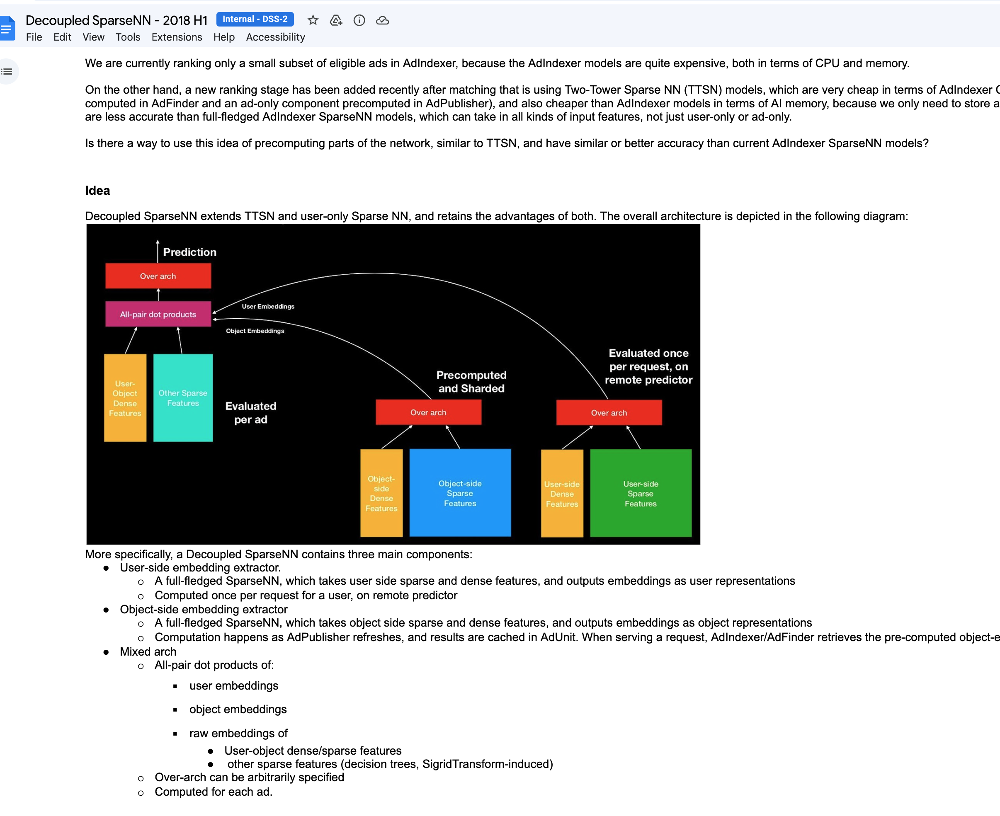
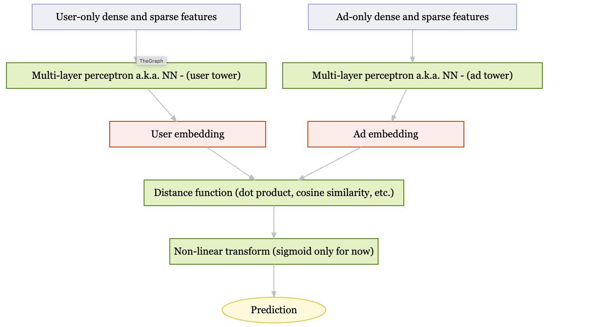

# Ads Score
#adsscore #adsranking #adsvalue #qualityscore
Ads score is a central concept and measurement tool used in ads ranking. It is used to measure ranking model performance (accuracy).
Why do we need something like ads score? Why won't measuring click-through-rate (CTR) or conversion-rate (CVR) be sufficient? Because the "value" of each click and conversion is different. Obviously, the value from user purchasing a car after seeing an ad is different from that of liking a FB page. In fact, ad score can be roughly thought of as a value weighted version of CVR, without the denominator, because the denominator is the same across comparison groups during experimentation.

Think of ads score as a summation. For a given set of users, and on a given set of days, ** it sums over all the "conversions" from these users, weighted by the value of the conversions** . A **conversion is what advertisers want to "optimize"** (or "obtain through paying to show their ads"): it could be a **mobile app install, a mobile app engagement event, a product purchase on advertiser website, a Facebook page like**,s, etc.
When we say a model X is 0.5% better than model Y when measured through ads score, we are saying, when I replace model Y with X in an online experimentation, the users in the test group using model X generated 0.5% more weighted conversions than the users in the control group using model Y, over the same period of time.

The above is a gross simplification: I am actually only explaining the "ads value" part of ads score. Ads score = ads value + quality score. But let's start simple and build up from here.


## long term' value- 50%-60% of ads score gain' can be linked to short term and long term revenue growth...


## Upper bound on Ads Score

As you said in the beginning of the article, ads score is used to measure the performance(accuracy) of models. Thus can I assume that ads score has an upper bound? Which should be the value when all models could predict 100% of the conversion of users correctly. But as your explained, ads score is the summation of all weighted user conversions. That seems does not have an upper bound? Because our goal is to create as much valued conversion as possible in a given time for a given set of users. How could we explain the relationship between these two??

Answer:limits - one physical limit is the user side- only so many con'version's the=y can do, and the advertiser side hras only so much budget they can spend.


controlled by bids...


## Prediction models are trained to optimize normalized entropy

the gap between NE and ads score is the weight of conversion, and also the fact that the graph of models and how they interact, are composed, etc,
is non-linear. If we are to consider this, we can get to something similar to ads score from NE.
so, we have both the weighting issue, and the composition/non-lin'earity issue.

For example P(app install) is competing with P(click) in the same auction somehow.

So, its to some extend an objective function definition matter
[[science.math.Optimization.Objective Functions]]

To note, the iRev commetee in meta is full of super high level IC's.

# Determining Value of conversion
The ad delivery system operates as an auction where advertisers bid on conversions they aim to achieve, such as mobile app installs, engagement events, product purchases, or page likes. There are two bidding strategies:

1. **Advertiser-set bids**: Advertisers explicitly place bids for conversions when creating ads. It is assumed that the value of a conversion equals the bid amount. The auction mechanism is designed to encourage **truthful bidding**, meaning advertisers attain optimal ad performance (maximizing the number of conversions) when their bids reflect the true value they assign to each conversion. Under the assumption of rational behavior, bids converge to true conversion values. However, this assumption may not always hold in practice due to factors like incomplete information or strategic misrepresentation.

2. **System-optimized bids**: The ad delivery system places bids on behalf of advertisers. In this case, it is also considered that the bid for a conversion will converge to its true value for the advertiser. A detailed explanation of this mechanism requires further discussion, which will be addressed in subsequent topics.


Sometimes we compete with other advertisers on behalf of our advertisers - audience network.
## actually constant bid is the optimal strategy. 
"Pacing" system's job is to discover the such optimal constant bid. There is a simple proof to this which I will save to a later post. Core idea has to do with the pricing mechanism used in auction (VCG): you will have to lower your bid below the second highest bid to actually change how much you pay (which also would cause you to low the auction).

[[science.stats.Machine Learning.Cold Start Problem]] happens here for the optimal bid discovery in' certain situations.


now we use second price auction...


you pay the seciond price


### Comments about bidding strategy/value optimization

Will bidding by FB ads delivery system always perform better than advertisers bidding in terms of advertisers’ benefits? 

The key factor is defining what constitutes "better performance." Only advertisers know which outcomes are beneficial for them (for example, an advertiser focusing on landing page views may aim for offline sales, which Facebook might not track).

Many ad agencies bid on behalf of their clients within Facebook's ad delivery system, claiming to achieve a higher ROI than Facebook itself. These agencies often employ advanced machine learning models and automated scripts to adjust bids in real-time through ad interface APIs.

Ideally, Facebook should offer A/B testing tools for advertisers to compare performance directly. A crucial aspect is establishing causality. When landing page views lead to offline sales, without knowing which offline sales resulted from specific landing page views, it's challenging to experimentally determine which bidding strategy is more effective. The concept of lift or incremental conversion seeks to address this causality issue.


[[private.experiments.lift]]]]


## Day 3 ads ranking

Rank by $P(conversion|impression)* value(conversion)$, select top k.

the value is encapsulated in the value(conversion).


## each ad has targeting criteria, 
which determines which users it can be shown to.


# Some Ranking Terminology

**ecvr** - expected conversion rate. The probability that a user will convert given that they see the ad. This is a key component of the ads score.

**ecpm** - expected cost per mille. The expected cost of showing the ad to 1000 users. This is a key component of the ads score.

bid*ctr= expected cost per impression.

theer is calso conversion' rate ...

$P(conversion|impression) = P(conversion|click) * P(click|impression)$

problem is often broken down and composed like that...
##  advertisers control for which objective (conversion) they want to optimize for

and then the system does it..

These are also called ' ranking products''

# There is a declarative 'language'  
called ' unified optimizaiton' framework' , used to express composition 'logic as trees of prediction's as part of 
the ranking flow; that was one of early flagship technologies, developed by ads ml infra...


# Model training

predict the probability of click is an user is shown an ad.

User features

ad features

'is shown'- context


Minimize Average(over every example (input, output) from training example set){Loss(output, f(input)))}
...

etc..

# Feature engineering work for ads recsys vs images

 vision: start with handcrafted features, then move to learned features, then move to end-to-end learning.
 ads system: features change, very diverse, so handcrafted features are still used, as well as  learned ones.
[[science.stats.Regression.Recommender Systems]]
[[science.stats.Deep Neural Networks.Vision Models]]

A lot of the feature engineeering- design human intuition guided algos that tarverse rich daat graph..


auto learning can progress there..

feature selection algorithm- fuature importances..

## Relative Importace of Various Parts of the Modelling Stack

In the context of machine learning (ML) engineering for ads, the importance and contribution of different optimization methods can vary over time. 

Historically, "feature engineering" and "model architecture design" have been highly prioritized for horizontal ML work.

 For vertical ML work, such as determining the training dataset and loss for specific ad metrics like ROAS or incremental conversion ads, "training label/training dataset and loss function" are also crucial.

In earlier times, before certain advancements, "model architecture design" was relatively static, while "feature engineering" was more dynamic, focusing on counter features. With the advent of new models and techniques, the focus shifted towards model architecture design, which involved simpler sparse features and preprocessing. This led to significant improvements in ad score gains.


new infra, such as factorization machines/sparsenn started an era where emphasis is on model arch design with simpler feature ingineering (sparse features, preprocessing...
)

As these models matured and the gains started to plateau, "feature engineering" regained prominence, particularly in the form of intent and content understanding, which integrates feature engineering with modeling. Concurrently, model architecture design evolved to include the tuning and addition of various sub-components, often requiring context-dependent co-tuning, rather than introducing entirely new architectures.
[[science.stats.Deep Neural Networks.Two Tower Sparse Neural Network]]

# evoluation of ranking models
2010-2024- gradient boosted trees.

2015- large capacity logistic regression'models- sparse categorical features'- and multi-categorical features..


embeddings- different way of 'usin' sparce categorical features in the model- map each nonzero sparse feature into an array fo the scalare weights.
[[private.ml.double helx and sigrid]]

at this time, where were 3 types of módels- xgboost stuff, large capacity logistic regression models, and embeddings.

separately trained and 'combined in a 'stacking' model.
see [impact coding for high cardinality](https://win-vector.com/tag/impact-coding/) features.

[[ML system design.Online Training]]]]

# Example ads ranking system composition





So in essence, what ends up happening is we pre-train separately user embeddings object embeddings as well as handcrafted or other learnt dense features such as like various counters for the click through historical click rate and so with various aggregations, and then all those two towers are basically have some embedding for each and between them and you do like a full fully connected problem between them and and then of course a  sigmoid layer, how to do the final logistic regression and figure out the probability for whatever conversion type you are looking at as defined by the advertiser



# 
In the next few posts we will take a closer look at the specific details of f (model architecture) and X (features) as they are actually used in production today or in the past. In this post I would like to sketch a high level history of how ads ranking models evolved over the past so you have a framework to hang the details we will be discussing around. The history is greatly simplified as I will not talk about branches we took but trimmed down eventually.

Circa 2010 - 2014 ads ranking models f were dominated by Gradient Boosted Decision Trees (GBDT). These are decision forests and trained using a training algorithm that is very different from what I described so far. The features X were dominated by “dense counters”: counting number of times a particular type of actions that are associated with a user or an ad in a past time period (# impressions a user saw in the past 3 months, # clicks an ad received in the past 2 days), and arithmetic combinations of these counts (e.g. click through rate for a user in the past 3 months = # clicks / # imps for that user). The output from GBDT was further processed by a linear model and that layer has now been superseded by later technology.

2015 saw the very successful introduction of large capacity logistic regression models, which was cherishingly named Sigrid models. This was when our models grew from dozens of MB to dozens of GBs. The features X now included sparse categorical features: a large number of features that take 0 or 1s, but for a given training example, only a handful of them are nonzero.

That same year we introduced embeddings into our models (called DoubleHelix models), which is a different way of “using” sparse categorical features in the model: they map each nonzero sparse feature into an array of the scalar weights. Curiously at this circa, there are actually 3 types of models in the system, GBDTs, large capacity logistic regression models and embedding models. They are separately trained and “chained together” to make a prediction on a given (user, ad) pair.

# day 12
Day 12 Challenge — The evolution of ads ranking models (2)
By the end of 2015, and throughout 2016, our models continued to evolve. Fully connected neural nets (or multi-layer perceptron, MLP) were introduced as yet another separately trained model that is then “chained together” with the rest of the models.

It would be revealing to explain what do we mean by models that are separately trained and then chained together. The basic idea is that one can factor a model f into multiple functions composed together, e.g. f = f1(f2(X1), X2), where X1 and X2 are subsets of the input features X and X1 U X2 = X. To train f, you first train f2 (on the same training data set; for an example (X, y), use (X1, y) to train f2), then you use f2 to “regenerate” training examples to train f1. That is, for any training example (X, y) that you would use to train f, you rewrite that example to be ([f2(X1), X2], y) which is then fed into f1. Once f2 and f1 are trained, you define f(X) to be f1(f2(X1), X2); that is, any time you want to evaluate f(X), you evaluate f1(f2(X1), X2) instead. This is also called “layer wise” training.


One notable exception is GBDT models, which cannot be trained with gradient descent because its f is not differentiable in a lot of places; so we continue to train GBDT models separately and “chain it together” with a SparseNN model.
Does that imply that GDBT is always either the first or last stage of the training pipeline? Or can it be anywhere in between?

You can have a model “preprocess input”, then feed into GBDT, then output to another model. This is a real case with DoubleHelix model -> GBDT -> Sigrid/SparseNN


Another separate but interconnected evolution line we need to trace is the evolution of X (the features). In the earlier part of the history, we mentioned that the advent of large capacity logistic regression model and embedding model popularized the use of sparse categorical features (such as “Facebook page ids a user liked in the last 3 month”). The dominant form of computation used in generating X involved operating on lists of lists, which are stored in batch or streaming form (think of a Hive table or a Scribe category): join, filter, group-by and arithmetic aggregation such as count, sum, concatenate, etc. For example, # clicks for a user is computed by grouping by user id on the user clicks table and aggregating by counting.

This continued until 2017 H2 with the advent of user intent and content understanding. Feature computation became dramatically more complicated as feature generation now involved invoking models, with much heavier emphasis on streaming computation, and with heavier need of computing user and ad “interactions”. As an example, computing a similarity score between the “categories” of Facebook pages a user liked in the last 30 days, and the “categories” of an ad based on its Facebook page; Facebook page to “categories” mapping is computed by a model, and this similarity score needs to be updated whenever the user has liked a new Facebook page.

By late 2018 the “end to end training” pendulum started to swing back a little as ads ranking engineers started to explore the direction of “pulling part of a model out” and train them separately (and “chain back” later). The flagship effort was called ads brain or Transductive User Modeling (TUM; the name “transductive” refers to another concept unrelated to separate training though). Why would we ever want to separately train a model? One of the primary motivations is to be able to tackle the end to end training latency problem: we can increase the capacity of this separate model dramatically but train them less often and directly use them as-is when training the “main model”; as an analogy think of pre-built libraries which don’t get build from source files when building a software codebase. TUM is still in its early days.

Curiously enough, the output from the TUM model is an input feature (Xi) to the main model. “Pulling part of model out to be separately trained” is a form of feature engineering. Modeling and feature engineering have started to fuse together: feature generation involves invoking models, and modeling is exploring factoring out a separately trained sub-part which can be recast as feature engineering. This trend is reflected in our technology roadmap too: F3 will support TUM inference natively.

This concludes the tracing of the evolution history and we will dive into more details of the model architecture and features mentioned in the history.

# modelling large cardinality categorical features

Day 17 - “Big capacity” models with sparse categorical features
Day 17 Challenge - “Big capacity” models with sparse categorical features
On Day 16 we entertained the idea of categorical features can give rise to large model sizes. In our ad id categorical feature example, in practice, there would be on the order of 10 M ad ids in the system, thus a model that uses the ad id categorical feature would really look like
sigmoid(... + [ad id == ad_id_1] * w1 + ... + [ad id == ad_id_n] * wn + ...)
Thus, the model would need to learn 10 Ms of weights. We also call the ad id feature, sparse categorical feature, or sparse feature in short, because for any example X that model need predict or be trained from, only one or a few of the Xi’s that correspond to such a feature would be non-zero. Such way of encoding an id number (such as ad id = 10000) into a list of sparse binary values (e.g. [0, 0, ..., 0, 1, 0, ..., 0]) is also called one hot encoding.

Earlier we explained we often chain a model on top of a GDBT (Gradient Boosting Decision Tree) model. Instead of directly taking the GBDT model output (which would be a single scalar), we define a categorical feature “Tree leaves that are activated” and one hot encode this feature (as we always do for categorical features) as Xi’s in the model:
[[leaf 1 is activated], ..., [leaf n is activated]]
To understand what do we mean by “a leaf is activated”, a decision tree would take an input X and each node of the tree is a predicate in terms of some Xi (e.g. X3 > 5) and routes the input to the left or the right tree depending on if the condition is true; and the input will eventually end up in a leaf and we say that leaf is activated. 


basically, similar to a variant of impact encoding.


Summary- take away the last layer of a model, and return the intermediate layer= this is a feature vector to be used

[detailed discussion on hybrid architectures](https://scontent-vie1-1.xx.fbcdn.net/v/t39.8562-6/240842589_204052295113548_74168590424110542_n.pdf?_nc_cat=109&ccb=1-7&_nc_sid=e280be&_nc_ohc=HOYYtFxDy6YQ7kNvgESomSu&_nc_zt=14&_nc_ht=scontent-vie1-1.xx&_nc_gid=A-5Ma4Fk3rst0z3S_j8AVer&oh=00_AYBd0WkHYE10KJ5HhnTEExnMrOOnkA8-aVGh9D46e46Qcg&oe=675B98CA)
[gbm as feature transformers](https://medium.com/nerd-for-tech/gbdts-random-forests-as-feature-transformers-cd0fcf2be89a)


# comments on n-grams and so on

The initial motivation of dot product was exactly doing the low rank approximation for bi-gram. So we can directly think about pros/cons for low rank approximation.
If the matrix is truly low rank in reality, there will be zero difference between dot product and bi-gram. This case bi-gram will suffer from large number of weight but dot product will suffer from non-convexity problem. Therefore, we should prefer bi-gram when computational resource allows and dot product is a way to save computation resource.
Practically low rank approximation is always an approximation, when going through FM we sacrifice convexity but having less parameter will give us less chance of overfitting, otherwise the model we get will be very hard to generalize. Even if we have infinite computational resource going to lower number of parameters can potentially be beneficial.
Hashing on bigram can be viewed as another way of reducing parameters, but it's an unstructured way of dimension reduction, i.e. it's not leveraging any insight we have for the matrix. If we view we can somehow linear combine two features to construct an orthogonal space with lower dimensionality than cardinality, we should expect FM gives a better performance.
In summary,
Strict low rank weight matrix we should use bi-gram > dot product > bi-gram with hashing.
Approximate low rank weight matrix with data >> cardinality(X1) * cardinality(X2) we should use bi-gram > bi-gram with hashing > dot product.
Approximate low rank weight matrix with data << cardinality(X1) * cardinality(X2) we should use dot product > bi-gram > bi-gram with hashing.
High rank weight matrix (features don't have any correlation) bi-gram with hashing is not different from dot product, and we should use bi-gram > bi-gram with hashing = dot product.


# ads bidding system

	Ads are predominantly charged by impressions, with a smaller subset charged per conversion.
	•	Ad ranking uses expected conversion probability and bid to determine order and pricing.
	•	For CPA ads, the price is adjusted by dividing the eCPI by the probability of conversion.
	•	For oCPM ads, the price is charged on impression display, not on resulting conversions.
	•	Under accurate probability estimation, both impression- and conversion-based payment models yield equivalent total costs.

    * pay by impression is to decrease the incentive to fake conversion data and make the bidding closer to 'truthful' bidding.o
# paying for ads


AdMonitor ensures that the logs used to charge advertisers meet quality and legality standards. It applies rules that exclude events from charging if they originate from Facebook’s corporate network, occur outside the ad’s active timeframe, or represent duplicate impressions or conversions. Over-budget checks exclude events delivered after the ad’s budget is spent, for both oCPM and CPA ads. Even legality-failing events are still recorded, flagged accordingly, and made available for downstream systems to interpret. Finally, AdMonitor calculates charges for each ad, feeding that data into billing and supporting real-time spend monitoring for the ads delivery system.

key legaligy rule is that if we're over budget, we don't charge the advertiser for the overdelivery.

biggest reason for overdelivery might be organic: the time different between when ads delivery system decide to bid and serve the ads and when the impression happen (and even worse, when the conversion happen for CPA ads). One can make the gap smaller by predicting the "spend" at serving time, but hard to remove it.


# Bidding Basics

Advertisers place the bid on a conversion: we assume value of conversion = the bid of conversion.
Facebook ads delivery system places the bid on a conversion on behalf of the advertiser. For the next few days let’s discuss the subsystem that places bids on conversions on behalf of the advertisers. Such subsystem is called the bidding system, also common referred to as the pacing system.


his objective can be achieved by finding the minimum bid for the ad that could result in it completely spending its budget. The bidding system then uses this “minimum bid” as the bid for the ad. It should not be hard to see that the higher the budget, the higher the “minimum bid” will need to be.

 can compute cost per conversion $y = ad budget / number of conversions the ad gets. As long as $x > $y, a rationale advertiser trying to maximize # conversions is incentivized to increase their budget to get more conversions. For reasons we will explain later, incremental conversions through incremental budget will cost more per conversion, and thus the average $y ( = ad budget / number of conversions ) will increase as the advertiser increases ad budget. An equilibrium will be reached when $x = $y, and such an advertiser will stop increasing their ad budget to avoid incurring a loss.

We just proved in that in the equilibrium, the bid that the bidding system uses on the behalf of the advertiser converges to their true value of the conversions the ad is trying to get.

bid=value (per conversion
)


we rank ads by Value(conversion) * Pr(conversion | impression). In fact, since we only know Bid(conversion) and that value is approximated by bid, we rank ads by Bid(conversion) * Pr(conversion | impression).


are other types of bidding mechanism we offer that suit different needs of the advertisers. For example, there are advertisers who want their average cost ($y above) to never excelled a threshold they set - that's basically they are trying to establish a specific profit margin. We offer average cost bidding for them.

#  optimal bidding strategy


A’s budget is completely used up;
A wins maximum number of auctions.

The solution'is a constrant bid, similar to the threshold fo online knapsack problem.

in practice, the actual bid is:

So our real auction price (eCPM) is (Here eCVR is the estimated rate of the advertised optimized goal is achieved)
paced_bid * eCVR + quality_bid

Pacing system would help advertisers to win auctions at a roughly constant speed, while guaranteeing that your budget can be spend. You can think of it as a control system. If you are winning auction in a speed faster than normal, it lowers your paced_bid, vice versa.


On a high level, the formulation assumes each conversion the advertiser is optimizing for gives the same value to the advertiser regardless of the user and the context. Thus, two FB page likes are assumed to give the same value, as long as the advertiser says they are optimizing for FB page likes; and two mobile app installs are assumed to give the same value, so long as the advertiser says they are optimizing for app installs. 

In practice, the 'true' value to the advertiser (hidden to FB) of these conversions could well be different (for example, two FB page likes could lead to different product purchase behaviors, and the engagement behaviors could be different post installing the same app), but they are in an unobservable space from the perspective of FB. If such difference does exist from the perspective of the advertisers, are measurable, and the advertiser is willing to share such data to FB (in the form of pixels, SDK calls, etc.), then they should choose to optimize for a 'lower funnel' conversion when they set up their ad. e.g. optimize for product purchase as opposed to FB page likes, optimize for app engagement as opposed to app installs. In the more 'extreme' case, we even allow the advertiser to differentiate the value of each purchase, as in the 'ROAS' product example I mentioned above.


# Delays in the bidding system feedback loop

Can be bad.

real spend ratio > expected spend ratio-> decrease bid
real spend ratio < expected spend ratio-> increase bid

bidding = 'pacing' system

# distributed system for the opportunity curves

Summary:
- A stateful control algorithm adjusts bids in real-time based on budget spend ratio.
- Early implementations ran partial computation on every delivery machine, using distributed logic.
- A centralized service (Metronome) was introduced for efficiency, broadcasting computed bids to delivery machines.
- Centralization saved CPU on delivery machines but introduced higher communication overhead.
- Metronome uses a primary/secondary replication scheme for fault tolerance.

```mermaid
flowchart TD
    A[Get Budget Spend Ratio] --> B[Run Stateful Control Algorithm to Determine New Bid]
    B --> C[Centralized vs Distributed Compute Decision]
    C -->|Central Compute| D[Metronome Service (Primary/Secondary)]
    C -->|Distributed Compute| E[Distributed Calculation on Delivery Machines]

    D -->|Bid & Control Info Broadcast| F[REX P2P Clusters]
    E -->|Fetch Real-time Spend from AdMonitor| F

    F --> G[Ads Delivery Machines Apply Bids]
```


# Raising Budgets causes higher average costs

Raising budget causes average cost to rise, because the marginal cost of each additional conversion is higher than the average cost. This is because the marginal cost is determined by the bid, which is set to the value of the conversion. As the budget increases, the number of conversions increases, but we are already winning all 'cheap auctions' anyway.

````mermaid
flowchart LR

    subgraph BiddingSystem[ Bidding System ]
        direction LR
        M[Bidding Service (Centralized)] 
    end

    subgraph AdsServing[Ads Serving Component]
        direction LR
        subgraph R[Ranking Modules]
        end
        P2P[P2P Broadcast Mechanism]
    end

    subgraph Renderer[Ad Renderer]
    end

    subgraph Logging[Real-time Logging]
    end

    subgraph Monitor[Spending Monitor]
    end

    AdsServing -->|Ad Request| R
    R -->|Ads with price| Renderer
    Renderer -->|Impressions & conversions| Logging
    Logging --> Monitor

    Monitor -->|Real-time spend info| M
    M -->|Bids| P2P
    P2P --> R
```