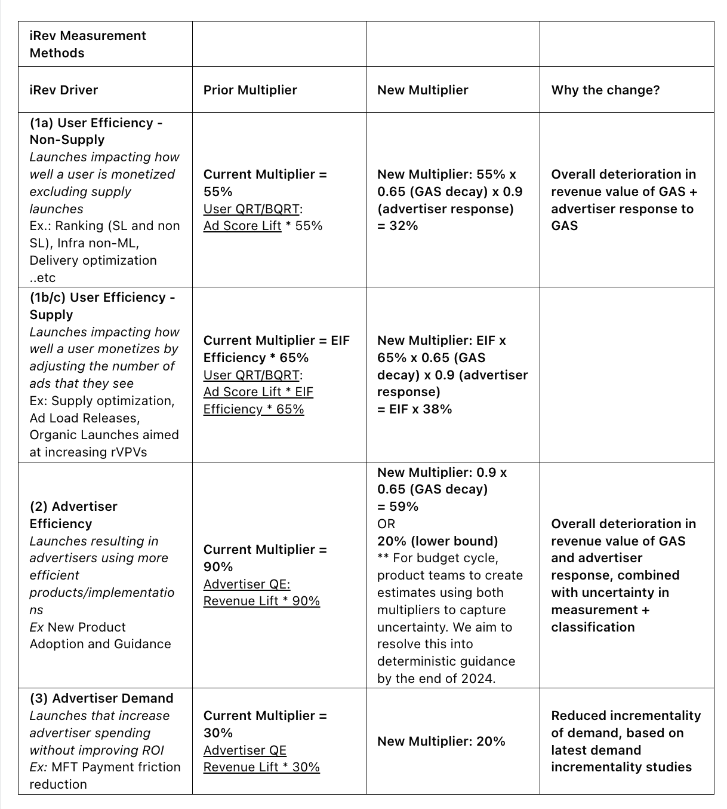

so basically, everyhthing is dropped by a bunch...

* advertiser response has changed (20% of the issue)
* product delay and measurement issue (80% of the issue)

effect of interest rates, macro factors, on the advertiser response- included..

## Competition 

In short, if we assume budgets are unlimited (e.g borrowing money woth low interest) then competition is negligible. Advertisers will continue to spend up to some equilibrium CPA point. However, if budgets are not unlimited then there is a competition tradeoff at play and this is included in forecasts given recent interest rate changes.

