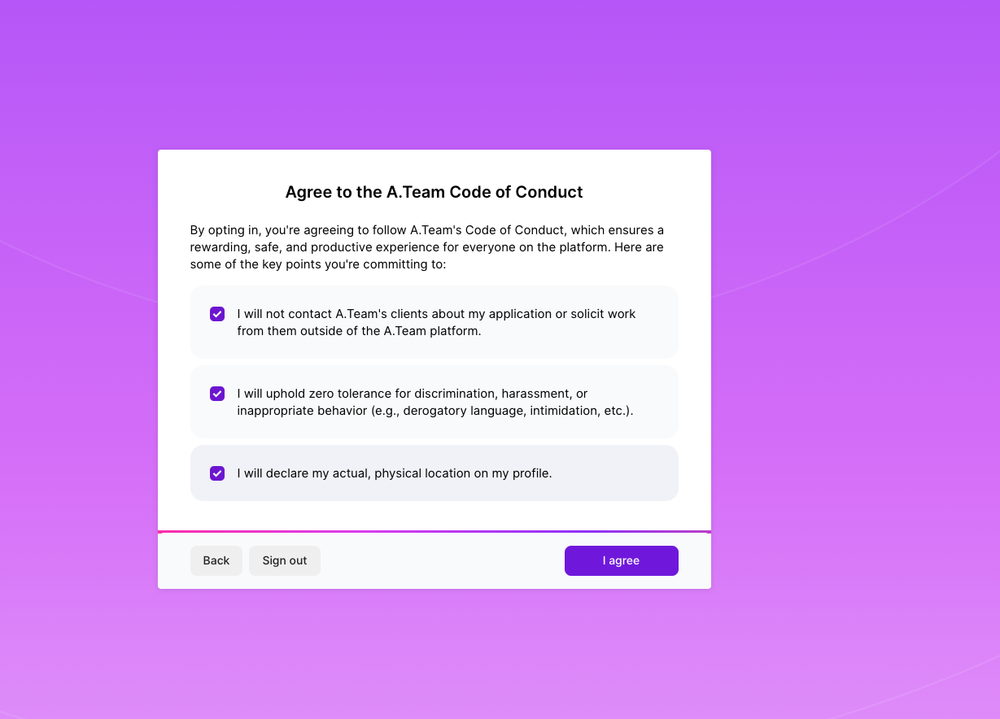

Platform Code of Conduct
This is the A.Team Platform Code of Conduct!
We’re transforming the way companies build and the way people work. As with any new model, especially one that emphasizes autonomy, we’re iterating on these guidelines to make the A.Team experience a success for everyone involved!

We’ve worked with a committee of 10 builders from the A.Team community to compile these guidelines, incorporating learnings from several years and hundreds of missions, with only one thing in mind: Ensuring the Greatest Success of the Entire Community of A.Team Builders Over the Long Term.

Questions? Shoot a note to help@a.team 😎

Honesty:
Underpromise, Overdeliver: only join missions you actually have the bandwidth and are qualified for. This might mean turning down a really great mission once in a while.

1. Only take work you have the time for.

Make sure your availability for a mission you ask to join isn’t interefered by other projects you are currently engaged in.

2. Only take work you have the expertise for.

Companies vary on how much experience with their tech stack and product requirements they’ll expect you to have on day one. Some will be okay with you spending time getting up to speed or learning a new language, but others may not.

3. Work on missions you’re genuinely excited about.

Being motivated and passionate about building a product is as important as it gets. We diversify the missions we get on board - so wait for ones that will actually excite you, and to which you can contribute from the off.

4. Keep your information up to date.

Make sure that you provide accurate information about your location, availability, skills, and experience on your profile and requests, and update it as necessary.

Responsible Community
Grow the community: One of our core values is creating transparency, as opposed to an opaque agency structure when you don’t know the people actually doing the work. Another one is abundance: more great builders = more great companies = more great missions. It also means more great teammates for you! Accordingly:

1. Subcontracting

For transparency’s sake, the Builder Agreement (that you’ll typically sign with the companies you engage) prohibits subcontracting your obligations without (1) getting A.Team’s & that company’s express written consent; and (2) signing a clear agreement with the subcontractor.

2. As an Alternative to Subcontracting

Once you find a mission that could be relevant for a friend, invite them to join the A.Team platform directly (and earn BuildTokens for doing this!).

Inclusivity & Safety: Diversity and inclusion make our community strong. We encourage participation from the most varied and diverse backgrounds possible and want to be very clear about where we stand. Any discrimination will not be tolerated. Diversity of thoughts and backgrounds is at the core of making great teams and a great community.

book icon
As a reminder: you can report any suspected violations to community@a.team or anonymously here. Everything will be kept strictly confidential.

Conduct or speech which might be considered sexist, racist, homophobic, transphobic, ableist or otherwise discriminatory or offensive in nature.
Do not use unwelcome, suggestive, derogatory or inappropriate nicknames or terms.
Do not show disrespect towards others (jokes, innuendo, dismissive attitudes).
Intimidation or harassment (online or in-person).
Disrespect towards differences of opinion.
Inappropriate attention or contact. Be aware of how your actions affect others. If it makes someone uncomfortable, stop.
Not understanding the differences between constructive criticism and disparagement.
Sustained disruptions.
Violence, threats of violence or violent language.
A.Team’s Role
Facilitating conversations

Once selected for a mission, please be advised A.Team can help facilitate conversations with the company, including about billing. Billing is bi-weekly - the time a company may take to pay an invoice is 3 weeks, on average, and immediately thereafter A.Team advances payment. If 4 weeks have passed, let us know and we’ll advance payment immediately (all provided no dispute is in place).

Feedback

Provided you have any feedback for a company - reaching out to A.Team would increase the value we can provide to the community, being responsible for our colleagues’ experiences. You may also freely share feedback directly with the company which should provide them with the chance to mitigate any concerns.

These are the foundations of the community and breaches may result in removal.

book icon
You can report any suspected violations to community@a.team or anonymously here. Everything will be kept strictly confidential.

