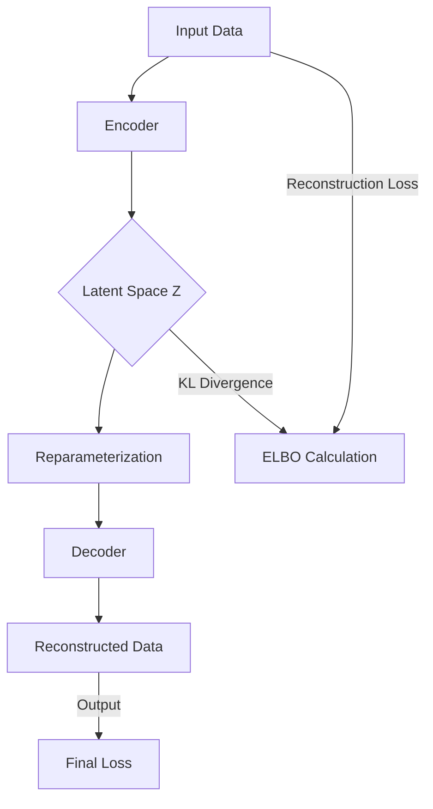

## denoising models
once trained, the gdiffusion model is able to generate images from gaussian noise...

## diffusion models
very successful, denoising process, trian by
adding noise to images.

## add some amount of noise to the image
depending on how much you add, you can be close or not to the image...

