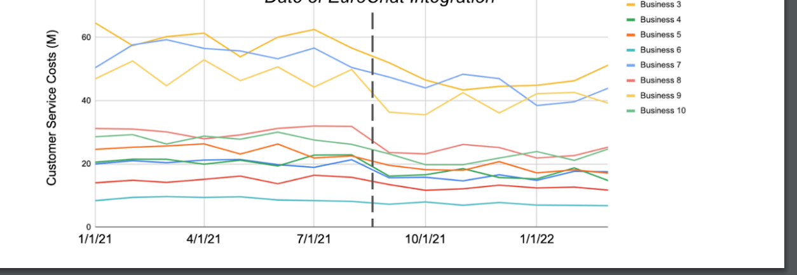

Several of my last interview candidates have been answering Q1 and Q2 in similar ways, and one of them jumped from Q1 to suggesting "a slide that Sales could use" which is asked in Q4, which is making me suspect that this question or parts of it are leaked. 

I think this is still a really good question though if using the follow up questions/hints to push candidates to explain their answers in more detail: "What are some potential challenges/issues with X methodology?" and "Can you walk me through your approach, for example what data points would you look at and what comparisons would you make" or "What recommendation would you make to the team based on the result of that analysis" have been helpful to identify the stronger candidates. 

I also throw in some alternative follow up questions that aren't listed. Here are some examples of what I've been adding, which have also been helpful to identify stronger candidates:
1. (follow up to Q1, mainly for analytical design signal): If we had data that tags each business-to-user messaging thread by conversation topic (like complaint, return, additional product info, successful purchase, etc), can you walk me through an analysis that might determine which use case is having the most success?
2. (follow up to Q3, mainly for research/analytical design signal): If you pulled a list of businesses based on your criteria, and now you have a list of 10,000 businesses, how would you approach selecting the top 100? What data points would you look at and how would you sort?

Visual

# follow up questions

 "What are some potential challenges/issues with X methodology?" and "Can you walk me through your approach, for example what data points would you look at and what comparisons would you make" or "What recommendation would you make to the team based on the result of that analysis" have been helpful to identify the stronger candidates. 

Alternative Follow ups:

1. (follow up to Q1, mainly for analytical design signal): If we had data that tags each business-to-user messaging thread by conversation topic (like complaint, return, additional product info, successful purchase, etc), can you walk me through an analysis that might determine which use case is having the most success?

2. (follow up to Q3, mainly for research/analytical design signal): If you pulled a list of businesses based on your criteria, and now you have a list of 10,000 businesses, how would you approach selecting the top 100? What data points would you look at and how would you sort?