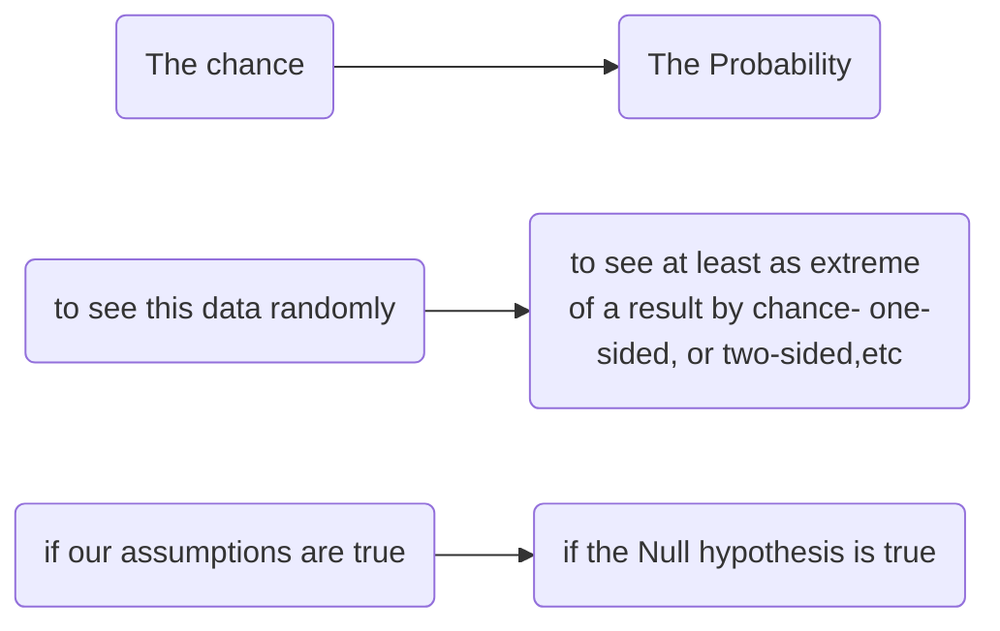

## Mnemonic flowchart

```mermaid
graph LR;
a(The chance)-->b(The Probability);
c(to see this data randomly)-->d(to see at least as extreme of a result by chance- one-sided, or two-sided,etc);
f(if our assumptions are true)-->h(if the Null hypothesis is true);
```

## Examples:
[jelly beans comics](https://xkcd.com/882/)

#TODO explain this...

